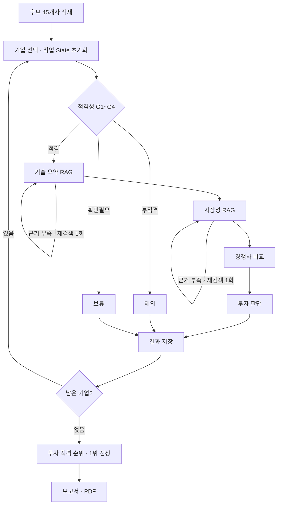

# AI Startup Investment Evaluation Agent

본 프로젝트는 **AI 반도체(Semiconductor)** 스타트업에 대한 투자 가능성을 자동으로 평가하는 에이전트를 설계하고 구현한 실습 프로젝트입니다.
창업진흥원 「2025 초격차 스타트업 1000+ 디렉토리북」 시스템반도체 분야 **45개사 전체를 평가**하고, 투자 적격 기업 중 1위의 투자 보고서를 생성합니다.

> **결과 한 줄** — 45개사 → 제외 27 · 보류 17 · **투자 적격 1** → **망고부스트코리아(DPU) 투자 추천, 79.0점**

## Overview

- Objective : 창업자·시장성·제품/기술력·경쟁 우위·실적 5개 관점으로 AI 반도체 스타트업의 투자 적합성 분석
- Method : LangGraph Multi-Agent, Agentic RAG(질의 재작성·재검색), Tool Calling, 코드 기반 점수·판정
- Data : 기업 디렉토리북 + 기술 로드맵(IRDS·UCIe·CXL) + 시장 보고서(SIA·WSTS·KIET·OECD) 15개 PDF, 169쪽
- Design : [설계정의서](docs/설계정의서.md) · [데이터 계약](docs/CONTRACTS.md) · [트러블슈팅](docs/TROUBLESHOOTING.md)

## Features (차별점)

1. **실측 기반 설계** — 코퍼스를 먼저 측정(영문 65%, 숫자·식별자 밀도 3.8%, 다단 레이아웃)하고, 청킹·임베딩·검색 방식을 그 결과에서 도출
2. **반증 가능한 임베딩 선정** — 골든셋 18문항 × 4개 비교군 실험. "성능 개선이 없으면 e5로 회귀"라는 번복 조건을 미리 정하고 측정
3. **LLM은 채점만, 판정은 코드** — 총점·투자 판정·순위를 Python이 계산. 채점은 3회 반복 후 중앙값(회차별 총점 77.0~79.0)
4. **전체 평가 후 1위 선정** — 처음 70점을 넘은 기업에서 멈추지 않고 45개사를 모두 평가한 뒤 순위를 매겨, 문서 수록 순서가 결과를 바꾸지 않음
5. **근거 추적** — 모든 수치에 근거 ID(`TEC-02-0008`, `DIR-C03-01`)를 달고, 본문에서 실제 인용한 출처만 REFERENCE에 수록

## Tech Stack

- Framework : LangGraph, LangChain(`create_agent` + `ToolStrategy`), Pydantic
- LLM/Generator : OpenAI **gpt-4.1-mini**
- LLM/Judge : gpt-4.1-mini (근거 충분성 판정, 스코어카드 3회 채점) — 최종 판정은 코드
- Retrieval : **Chroma + bge-m3 dense/sparse, RRF** — **Hit Rate@5 0.944, MRR@5 0.917** ([비교 실험](eval/results.md))
- Embedding : **BAAI/bge-m3** (오픈소스, 로컬 실행)
- Tools : 문서 검색(`search_tech_docs`, `search_market_docs`), OpenDART(상장 여부), Tavily(투자 단계·Exit·경쟁 제품)

**임베딩 선정** — 한국어 질의로 영문 문서를 찾는 **교차언어 검색**과 `128 GT/s`·특허번호 같은 **정확일치**가 동시에 필요합니다. bge-m3는 dense(의미)와 sparse(단어 가중치)를 한 모델에서 생성합니다.

| 비교군 | Hit@5 | MRR@5 | 정확일치 MRR |
|---|---|---|---|
| bge-m3 dense | 1.000 | 0.852 | 0.750 |
| **bge-m3 dense + sparse (채택)** | 0.944 | **0.917** | **1.000** |
| e5-base dense | 0.833 | 0.778 | 0.600 |
| e5-base + BM25(Kiwi) | 0.778 | 0.750 | 0.600 |

→ 번복 조건 불충족, **bge-m3 유지**. 개선은 설계가 예상한 정확일치에서 나왔습니다.

## Agents

| Agent | 역할 | 방식 |
|---|---|---|
| 후보 적재 | 디렉토리북 45개사 → 기업 레코드 | PDF 블록 좌표로 다단 복원 + LLM 구조화 추출 |
| 적격성 검증 | 비상장 · Series C 이하 · Exit 이전 · AI 관련 (G1~G4) | DART + Tavily 사전 조사, 규칙 판정 |
| 기술 요약 **[RAG]** | 기업 기술을 IRDS·UCIe·CXL 기준값과 대조 | 검색 도구 + 수치·측정조건 원문 검증 |
| 시장성 평가 **[RAG]** | 시장 규모·성장률·고객·위험 | 검색 도구 + 시장 범위 검증 |
| 경쟁사 비교 | 경쟁 제품 지표 비교 | RAG 재조회 + Tavily |
| 투자 판단 | 체크리스트 11문항 + 스코어카드 15항목 | LLM 3회 채점 → 코드 집계·판정 |
| 보고서 생성 | 1위 기업 보고서 (Markdown·PDF 5쪽) | State만 사용, 신규 검색 없음 |

## Architecture



- **Loop** — 기업별 순차 평가(외부), RAG 재검색 최대 1회(내부)
- **Branch** — 적격성 3분기, 예외 발생 시 해당 기업만 보류하고 다음 기업 계속
- **State** — 입력 · 흐름 제어 · 기업별 작업(기업 전환 시 리셋) · 전체 결과(누적) 4그룹

**투자 판단 기준** — 가중치 창업자 20 · 시장성 20 · **제품/기술력 30** · 경쟁 우위 15 · 실적 15 (자료로 확인할 수 없는 투자조건 항목은 삭제). **총점 70점 이상 + 기술력 평균 3.0 이상**이면 투자 적격. 동점은 총점 → 기술력 → 미확인 항목 수 → 실적 순.

## Results — 투자 보고서 핵심 포인트

| 단계 | 기업 수 | 주요 사유 |
|---|---|---|
| 적격성 통과 | 4 / 45 | 부적격 27곳(AI 관련성 G4 미충족 25 등) → 제외, 상장·투자 단계 확인 불가 14곳 → 보류 |
| 스코어카드 채점 | 4 | 망고부스트 79.0 · 디노티시아 75.0 · 엑시나 63.7 · 아이디어스투실리콘 61.0 |
| **투자 적격** | **1** | 나머지 3곳 보류. **디노티시아는 75점이지만 기술력 평균 2.67 < 3.0 → 보류** (기술 최소 기준 작동) |

**투자 추천: 망고부스트코리아 (79.0점)** — 데이터센터 CPU 부하를 줄이는 DPU 개발사 (보고서: 실행 시 `outputs/report.md`·`report.pdf` 생성)
- **강점** — 창업자 5.0/5 (서울대 교수·박사 창업팀), 경쟁 우위 4.3 (등록 특허 3건, NVMe 인증), Series A 842억 원 유치, 해외 고객 확보
- **리스크** — TRL·성능 지표 미공개로 NVIDIA BlueField·AMD Pensando와 정량 비교 불가, 시장 규모·매출 미확인(2점 처리)
- **투자 전 확인 조건** — 2024년 매출, 성능 벤치마크, 경쟁 제품 대비 수치 우위

## Lessons Learned

1. **라이브러리 충돌은 실측으로만 드러난다** — FAISS와 torch(bge-m3)가 각자 OpenMP를 싣고 와 macOS에서 프로세스가 죽었다. 결과가 같은 Chroma로 교체
2. **LLM 구조화 출력에는 숨은 규칙이 있다** — 클래스명은 영문만, `dict` 필드는 OpenAI가 400으로 거부. 레인 간 계약을 Pydantic으로 고정하고 테스트로 막음
3. **도구 설명이 곧 LLM의 사용 설명서다** — 검색 필터(`sub_domain`) 의미를 적기 전에는 LLM이 필터를 잘못 골라 정답 문서를 놓쳤다
4. **교차언어 검색은 영문 병기가 필요하다** — 한국어 질의가 유일한 한국어 문서(KIET)로 쏠림. 질의에 영문 용어를 붙이면 정답 복귀
5. **엄격한 검증에는 비용이 따른다** — 근거 충분성이 거의 매번 False라 재검색이 반복되고 시간이 2배. 원인이 기업 자료 부족이면 재검색으로 해결되지 않는다
6. **작은 표본은 튜닝하지 않는다** — RRF 가중치 0.7:0.3이 1문항 차이로 높았지만, 18문항에서는 과적합 위험이라 설계값 0.5:0.5 유지

## Directory Structure

```text
├── data/            # 원천 PDF 15개, manifest, 기업 레코드
├── agents/          # 역할별 Agent (loader·eligibility·technology·market·competitor·investment·report)
├── rag/             # PDF 파싱·청킹, bge-m3 하이브리드 검색
├── tools/           # 검색 도구, DART·Tavily 외부 조사
├── prompts/         # 역할별 프롬프트
├── eval/            # 골든셋·임베딩 비교 실험·적재 점검
├── outputs/         # report.md · report.pdf · evaluation_results.json
├── tests/           # 175개 테스트 (스키마·검색·분기·채점·보고서)
├── docs/            # 설계정의서·데이터 계약·세팅·트러블슈팅
├── state.py · graph.py · schemas.py · llm.py · config.py
├── app.py           # 실행 스크립트
└── README.md
```

## Usage

```bash
uv sync                      # Python 3.11 · 의존성 설치
cp .env.example .env         # OPENAI_API_KEY, TAVILY_API_KEY, DART_API_KEY 입력
uv run python app.py --as-of 2026-09-30 --pdf   # 전체 평가 → outputs/
uv run pytest -q             # 테스트
```

외부 조사 결과(DART·Tavily)는 캐시로 재사용합니다. 갱신이 필요하면 `uv run python -m tools.run_tavily_eligibility`를 먼저 실행합니다. 상세 환경은 [SETUP](docs/SETUP.md)을 참고하세요.

## Contributors

- 김세령 : PDF Parsing, 기업 구조화 추출, 문서 코퍼스 로딩
- 김현수 : Retrieval·Embedding 평가, 검색 도구·스키마, State·Graph 설계, 협업 환경
- 박세웅 : DART·Tavily 외부 적격성 검증, 경쟁사 비교
- 박인우 : 기술·시장 RAG Agent, 수치·측정조건 검증
- 성재원 : 투자 판단·반복 채점, 보고서·PDF 시각화
