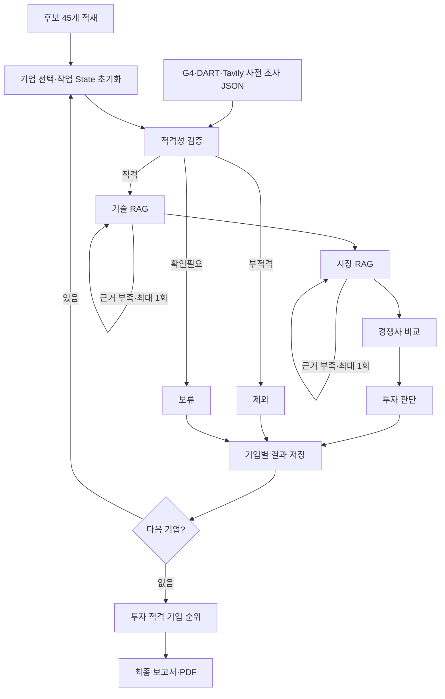

# AI Startup Investment Evaluation Agent

본 프로젝트는 **AI 반도체(Semiconductor) 스타트업**에 대한 투자 가능성을 자동으로 평가하는 에이전트를 설계하고 구현한 실습 프로젝트입니다. 창업진흥원 「2025 초격차 스타트업 1000+ 프로젝트 디렉토리북」의 시스템반도체 분야 **45개사**를 대상으로 합니다.

## Overview

- Objective : 창업자 역량, 시장성, 제품·기술력, 경쟁 우위, 실적을 기준으로 투자 적합성을 분석하고 투자 적격 기업 중 1위를 선정
- Method : LangGraph Multi-Agent, Agentic RAG, 외부 사실 확인, 코드 기반 점수·판정
- Data : 기업 디렉토리북·기술 로드맵·시장 보고서 15개 PDF, 169쪽
- Design : [설계정의서](docs/설계정의서.md), [State·출력 계약](docs/CONTRACTS.md), [개발 계획](docs/DEV_PLAN.md)

## Features

- PDF 블록 좌표(bbox)로 다단 레이아웃을 복원하고 기업당 1레코드로 구조화
- 기술·시장 문서 790청크를 분야별로 검색: dense + sparse 하이브리드 검색, RRF 융합, top-k=5
- 근거 부족 시 질의를 재작성해 기술·시장 분석을 각각 최대 1회 재시도
- G1~G4 자격 검증 → 체크리스트 11문항 → 15항목 스코어카드 → 코드 기반 총점·판정·순위
- 항목 채점 3회 병렬 실행 후 중앙값 집계; 미확인 항목은 2점, 검증된 환산 근거 없는 다른 통화는 합산하지 않음
- 실제 근거 ID를 보존하고 본문 인용에 사용한 출처만 REFERENCE에 수록
- 전체 기업 평가 JSON, Markdown, 차트·표를 포함한 5쪽 이내 PDF 생성

## Tech Stack

- Framework : LangGraph, LangChain, Pydantic
- LLM/Generator : OpenAI **gpt-4.1-mini** 기본값 (`LLM_MODEL`로 변경 가능), strict 구조화 출력
- LLM/Judge : 별도 Judge 모델 없음. Generator가 항목을 평가하고 Python이 중앙값·가중합·판정을 계산
- Retrieval : **Chroma + bge-m3 dense/sparse + RRF** — **Hit Rate@5 0.944, MRR@5 0.917** ([18문항 비교 실험](eval/results.md))
- Embedding : **BAAI/bge-m3**, 로컬 실행, 1,024차원 dense + 토큰별 sparse 가중치
- External APIs : OpenDART(법인·상장 확인), Tavily(투자 단계·Exit·경쟁 제품 검색)
- Report : Chrome headless HTML/CSS/SVG → PDF, PyMuPDF 페이지 수 검사

**임베딩 선정 이유:** 한국어 질의로 영문 기술 문서를 찾는 교차언어 의미 검색과 `TOPS/W`, `GT/s`, 특허번호 같은 수치·식별자의 정확 매칭이 함께 필요합니다. bge-m3의 dense와 sparse를 단일 모델로 생성해 두 요구를 처리합니다. 비교 실험에서 dense 단독 대비 MRR@5는 0.852→0.917, 정확일치 문항 MRR은 0.750→1.000으로 개선됐습니다. Hit@5는 dense 단독 1.000보다 낮은 0.944이며 모든 지표가 개선된 것은 아닙니다.

긴 입력 창은 선정 이유로 사용하지 않습니다. 청크는 700자·중첩 100자로 만들고 실제 최대 346토큰으로 측정했습니다. 비교 평가는 기업 문서 45개를 포함한 835개 벡터를 사용하며, 기본 분석 코퍼스는 기술·시장 790청크입니다. 골든셋 18문항의 검색 성능이 최종 투자 판단 정확도를 뜻하지는 않습니다. [선정 전략·번복 조건](docs/설계정의서.md#3-4-선정--baaibge-m3)을 참고하세요.

## Agents

| Agent | 책임 | 사용하는 방법 |
|---|---|---|
| 후보 적재 (`loader`) | 디렉토리북에서 기업 45개를 적재 | PDF 파싱·LLM 추출, 구조화 캐시 재사용 |
| 적격성 검증 (`eligibility`) | 비상장·Series C 이하·Exit 이전·AI 관련성 검증 | 사전 조사 JSON + Python 판정 규칙 |
| 기술 요약 (`technology`) | 기업 기술·실측 성능을 IRDS·UCIe·CXL 자료와 대조 | **RAG + LLM**, 수치·단위·측정조건 검증 |
| 시장성 평가 (`market`) | 목표 시장·성장률·고객·위험 분석 | **RAG + LLM**, SIA·WSTS·KIET·OECD 자료 |
| 경쟁사 비교 (`competitor`) | 공개 경쟁 제품과 비교·한계 기록 | **RAG + Tavily + LLM** |
| 투자 판단 (`investment`) | 체크리스트·항목 점수·투자/보류/제외 판정 | LLM 3회 채점 + Python 집계, 신규 검색 없음 |
| 보고서 생성 (`report`) | 선정 기업 또는 미선정 후보의 평가 결과 전달 | 저장된 State만 사용, LLM 서술 + 코드 표·차트·인용 |

외부 자격 조사는 별도 사전 스크립트에서 **DART + Tavily + LLM**으로 수행합니다. graph의 적격성 노드는 조사 결과의 기업 입력 해시·G1~G3의 14일 유효기간을 검사합니다. 조회하지 못한 사실을 충족으로 추정하지 않습니다.

## Architecture



분석 중 예외가 발생하면 해당 기업을 오류 보류로 저장하고 다음 기업을 처리합니다. `State`는 입력·흐름 제어·기업별 작업·전체 결과의 네 그룹으로 나눕니다. 기업을 바꿀 때 작업 필드를 초기화하고 평가 결과·오류는 누적합니다. 보고서는 마지막 기업의 작업 필드 대신 `evaluation_results`에서 `selected_company_id`를 조회합니다. 실제 graph 출력은 `uv run python app.py --graph`로 확인할 수 있습니다.

투자 적격 기준은 **총점 70점 이상이면서 제품·기술력 평균 3.0 이상**입니다. 가중치는 창업자 20·시장성 20·제품/기술력 30·경쟁 우위 15·실적 15이며, 총점·판정·동점 순위는 코드로 계산합니다.

## Directory Structure

```text
├── data/
│   ├── raw/             # 원천 PDF 15개·페이지 대응 정보
│   ├── processed/       # 기업 레코드·생성된 외부 조사 결과
│   └── manifest.json    # 문서 유형·분야·출처 메타데이터
├── agents/              # 역할별 Agent·채점·보고서 모듈
├── rag/                 # PDF 파싱·청킹·로컬 임베딩·하이브리드 검색
├── tools/               # DART·Tavily 사전 조사·검색 도구
├── prompts/             # 역할별 프롬프트
├── eval/                # 검색 골든셋·비교 실험·측정 결과
├── outputs/             # report.md·report.pdf·evaluation_results.json
├── tests/               # 스키마·검색·분기·채점·PDF 회귀 검증
├── docs/                # 설계·계약·세팅·개발 계획
├── config.py            # 모델·검색·평가 기준 상수
├── state.py             # State Schema·리듀서
├── graph.py             # Workflow·Loop·Branch
├── app.py               # 실행 스크립트
└── README.md
```

## Usage

Python 3.11과 `uv`, PDF 생성을 위한 Google Chrome 또는 Chromium이 필요합니다. [환경 세팅](docs/SETUP.md)을 참고하세요.

```bash
uv sync
cp .env.example .env
# .env에 OPENAI_API_KEY, TAVILY_API_KEY, DART_API_KEY 입력

# 최초 실행 또는 외부 조사 갱신
uv run python -m tools.g4_screening
uv run python -m tools.run_tavily_eligibility

# 전체 평가·보고서 생성 및 PDF 성공 확인
uv run python app.py --as-of 2026-09-30 --pdf

# 자동 검증
uv run pytest -q
```

실행 중 노드 진행 상황을 출력하고 `outputs/report.md`, `outputs/report.pdf`, `outputs/evaluation_results.json`을 생성합니다. 유효한 조사 캐시가 있으면 사전 조사 두 단계를 생략할 수 있습니다. `--as-of`는 근거 날짜 검사 기준이며 과거 웹 상태를 복원하지 않습니다. 모델 평가·웹자료 갱신에 따라 점수와 판정이 달라질 수 있습니다.

원천 데이터·환경 예시·테스트·평가 기준은 Git으로 추적합니다. 비밀키·검색/임베딩 캐시·실행 보고서·생성 조사 JSON은 제외하며 사전 조사 명령으로 재생성합니다. LLM 요청 timeout은 60초이고 D의 내부 에이전트 반복·구조화 출력 재시도를 제한합니다. PDF가 5쪽을 넘으면 오류를 반환하고 내용을 임의로 자르지 않습니다.

검증 기록(2026-09-30): **175개 테스트 통과**, 실제 후보 45개 평가·분석 오류 0건, 적격 4개사 채점 완료, 최종 보고서 5쪽. 첫 PDF의 분량 초과를 수정한 뒤 저장된 실제 평가 결과로 보고서 단계만 다시 검증했습니다. 기술·시장 실측 근거 부족과 경쟁사 수치 원문 검증은 보완 항목입니다.

## Contributors

Git 구현 기여 이력을 기준으로 담당 영역을 정리했습니다.

- 김세령 : PDF Parsing, 기업 구조화 추출, 문서 코퍼스 로딩
- 김현수 : Retrieval, Embedding Evaluation, State·Graph 초기 설계, 프로젝트 환경 구성
- 박세웅 : DART·Tavily 외부 적격성 검증, Competitor Research
- 박인우 : 기술·시장 RAG Agent, 수치·측정조건·시장 범위 검증
- 성재원 : 투자 판단·반복 채점, 보고서 구성, PDF·차트 시각화
