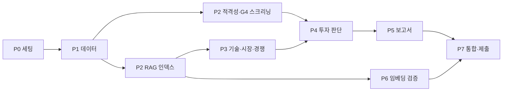

# 개발 계획

기준 문서: Notion `RAG-DESIGN_울산캠퍼스_4반_5조`. 코드와 설계가 어긋나면 **설계 문서를 먼저 고치고** 코드를 맞춘다.

마감: 개발 산출물(GitHub + `RAG-Output_울산-4반_{이름}.pdf`) **DAY 3 15:00**

2026-09-30 구현 현황: Chroma+bge-m3 하이브리드 검색, 790개 기술·시장 청크, 45개 후보 입력 통일, strict 구조화 출력·공통 timeout, 외부 캐시 유효성 검사, Markdown/JSON/PDF 출력이 구현되어 있다. 아래 레인 표는 원래 작업 계획이다. 5개사 수동 채점 캘리브레이션·Contributors 역할 확정·발표 자료는 별도 완료 증빙이 필요하다.

---

## 0. 공통 규칙

- 환경: [SETUP.md](SETUP.md) 참고. `uv sync` → `cp .env.example .env`. 패키지 추가는 `uv add <pkg>` 후 `pyproject.toml`·`uv.lock` 함께 커밋
- 브랜치: `main` 보호, 작업은 `feat/<영역>` → PR → 1명 리뷰 후 merge
- 커밋 전 `uv run pytest -q` 통과
- 에이전트 인터페이스는 고정: `run(state) -> dict`, 반환 키는 각 파일 docstring의 **출력** 계약만 사용. 계약 변경 시 `state.py`·설계 문서 동시 수정
- 흐름 제어(리셋·재검색·오류·루프)는 `graph.py`에 이미 구현·테스트됨 (`tests/test_skeleton.py::test_loop_flow_with_fake_agents`). 에이전트는 자기 산출물만 반환
- 모든 근거는 `current_evidence`에 근거 레코드로 반환: `{근거ID, 출처명, publisher, pub_year, source_type, url, source_page, 확인일, 원문발췌}`

---

## 1. 단계별 순서

| 단계 | 작업 | 산출 파일 | 완료 기준 |
|---|---|---|---|
| **P0 세팅** ✅ | uv 환경, 폴더 구조, State·Graph·흐름 제어 노드, 판정 코드 | `state.py` `graph.py` `config.py` | `pytest` 통과, `app.py --graph` 설계 mermaid와 일치 |
| **P1 데이터** | 15개 PDF를 설계 2-1 페이지 범위로 추출해 `data/raw/NN_이름.pdf` 저장, 문서별 메타데이터 작성 | `data/raw/*`, `data/manifest.json` | 합계 169p, manifest에 `doc_id, doc_type, sub_domain, title, publisher, pub_year, source_type, url, 원본페이지 대응` |
| **P1 후보 적재** | bbox 컬럼 복원 → LLM 구조화 추출 (15필드), 16·20쪽 제외 | `rag/parser.py::parse_company_pages`, `agents/loader.py` | 45건, `data/processed/companies.json` 캐시 |
| **P2 RAG 인덱스** | 02~15 로딩·700/100 청킹, bge-m3 dense(FAISS)+sparse 색인, `hybrid_search` | `rag/parser.py::load_corpus`, `rag/retriever.py` | 청크 토큰 분포 측정(512 초과 0건), 필터별 검색 동작 |
| **P2 적격성** | G1 DART, G2·G3 Tavily + 규칙, G4 LLM. **45개사 G4 사전 스크리닝 먼저** | `agents/eligibility.py`, `prompts/eligibility.md` | G4 통과 수 확인 (0~2건이면 해석 범위 조정 후 설계 기록) |
| **P3 기술 요약** | 질의 생성·재작성, 근거충분 자기평가, 지표 대조 | `agents/technology.py`, `prompts/technology.md` | 샘플 3개사 출력 계약 충족 |
| **P3 시장성** | 동일 패턴, `doc_type="market"` | `agents/market.py`, `prompts/market.md` | 〃 |
| **P3 경쟁사** | 기존 인덱스 재조회 + 웹서치 비교표 | `agents/competitor.py`, `prompts/competitor.md` | 〃 |
| **P4 투자 판단** | LLM 채점(체크리스트 11 + 스코어카드 15항목) → `total_score`·`decide`. **샘플 5개사 수동 채점으로 70점 임계값 캘리브레이션** | `agents/investment.py`, `prompts/investment.md` | 수동 채점과 LLM 채점 차이 기록, 임계값 확정 |
| **P5 보고서** | SUMMARY(½p) + 1~3장 + REFERENCE, 투자 대상 없음 케이스, md → PDF | `agents/report.py`, `prompts/report.md` | 5장 이내, 인용 근거만 REFERENCE |
| **P6 임베딩 검증** | 골든셋 18문항(교차언어 8·정확일치 5·기업정보 3·표 2), 비교군 4개, Hit@1/3/5·MRR@5 | `eval/` (`uv sync --group eval`) | README Retrieval 항목 기재, 번복 조건 판단 |
| **P7 통합·제출** | 전체 실행, 결과 PDF, README(그래프 이미지·Contributors), 발표 준비 | `outputs/`, `README.md` | 클린 클론에서 `uv sync && app.py` 재현 |

**병렬화**: P1 완료 후 P2 두 갈래와 P6(골든셋 작성)은 동시에 진행. P3 세 에이전트는 인덱스 API(`hybrid_search`)만 합의되면 병렬 가능. 인덱스 전에는 가짜 검색 결과로 프롬프트 먼저 개발.

---

## 2. 역할 분담 (안) — 논의용

5명 × 5레인. 레인마다 **소유 파일이 겹치지 않게** 나눠 병렬 작업 시 충돌을 줄였다. 담당자·레인 조정은 팀 논의로 확정한다.

### 요약

| 레인 | 한 줄 요약 | 소유 파일 | 선행 의존 | 후행 소비자 | 담당 |
|---|---|---|---|---|---|
| **A 데이터·파싱** | PDF 169p를 기계가 읽을 수 있게 만든다 | `data/`, `rag/parser.py`, `agents/loader.py` | 없음 (가장 먼저) | B, C, D, E 전부 | |
| **B 검색·임베딩** | "질문 → 근거 청크 5개"를 정확하게 | `rag/retriever.py`, `eval/` | A(`load_corpus`) | D, C(경쟁사) | |
| **C 외부 검증** | 웹·DART로 자격 요건·경쟁 제품 확인 | `agents/eligibility.py`, `agents/competitor.py` | A(기업 레코드) | E | |
| **D RAG 분석** | 기술력·시장성 분석 + 재검색 루프 | `agents/technology.py`, `agents/market.py` | A, B(`hybrid_search`) | C(경쟁사), E | |
| **E 판단·보고서** | 점수 → 판정 → 1위 보고서 PDF | `agents/investment.py`, `agents/report.py`, `README.md` | C, D 산출물 | 최종 제출 | |

**수정 금지 파일·레인별 소유 파일·전체 데이터 구조는 [CONTRACTS.md](CONTRACTS.md)** 참고. 보호 파일(`state.py`, `graph.py`, `config.py` 등)은 PR + 전원 합의로만 변경.

---

### A. 데이터·파싱

**목표**: 설계 2-1의 15개 문서를 정해진 페이지 범위로 준비하고, 디렉토리북 45개사를 구조화 레코드로 만든다.

| 작업 | 상세 | 완료 기준 |
|---|---|---|
| A1 문서 수집·추출 | 원본 PDF에서 설계 2-1 페이지 범위만 잘라 `data/raw/NN_이름.pdf`로 저장 | 15개 파일, 합계 169p |
| A2 manifest | `data/manifest.json` — 문서별 `doc_id, doc_type(company/tech/market), sub_domain, title, publisher, pub_year, source_type, url, 원본페이지↔추출페이지 대응` | REFERENCE 자동 생성에 필요한 필드 빠짐없음 |
| A3 기업 레코드 파싱 | `parse_company_pages`: pymupdf 블록 bbox로 좌·우 컬럼 복원 → LLM 구조화 추출(15필드 고정 스키마) → `data/processed/companies.json` 캐시. 16·20쪽 제외 | 45건, 샘플 5건 원문과 수동 대조 |
| A4 코퍼스 로딩 | `load_corpus`: 02~15 로딩, 700자/100자 청킹, 메타데이터 부착. 12·14 차트 문서, 01·04 표 밀집 문서 처리 방식 적용 | 청크 수 ≈ 582, 메타데이터 누락 0 |
| A5 loader 에이전트 | `agents/loader.py` — 캐시 있으면 재사용 | `candidate_companies` 45건 반환 |

- **필요 역량**: PDF 파싱(pymupdf), 정규식, LLM 구조화 출력(`with_structured_output`)
- **리스크**: 다단 펼침면 컬럼 복원이 가장 까다롭다. 막히면 A3만 LLM 비전/수동 보정으로 우회하고 사유를 한계점에 기록
- **논의할 것**: 원본 PDF 저작권 — 레포가 Public이면 `data/raw/` 커밋 여부 / `company_id` 규칙(예: `C01`~`C45` vs 기업명 slug)

### B. 검색·임베딩

**목표**: bge-m3 dense + sparse 하이브리드 검색을 구현하고, 선정 근거를 실측으로 검증한다.

| 작업 | 상세 | 완료 기준 |
|---|---|---|
| B1 인덱스 구축 | `build_index`: bge-m3로 dense(FAISS) + sparse(lexical weight) 생성, `.cache/`에 저장, 문서 해시 같으면 재사용 | 재실행 시 재색인 없음 |
| B2 하이브리드 검색 | `hybrid_search(query, doc_type, sub_domain, k=5)`: 메타데이터 필터 → dense·sparse 각각 → `rrf()` | D가 호출 가능한 안정 API |
| B3 토큰 분포 측정 | `AutoTokenizer`로 청크 토큰 수 측정 | 512 초과 0건 (초과 시 A와 청크 크기 조정) |
| B4 골든셋 | 18문항(교차언어 8·정확일치 5·기업정보 3·표 2) + 정답 청크 매핑 | `eval/golden.json` |
| B5 비교 실험 | 비교군 4개 × Hit@1/3/5, MRR@5, 색인 시간, 질의 지연 | 결과표 → README Retrieval, 번복 조건 판정 |

- **필요 역량**: FlagEmbedding, FAISS, 검색 평가 지표
- **리스크**: bge-m3 로컬 로딩(약 2.3GB) 시간·메모리. CPU에서 느리면 임베딩을 1회만 하고 캐시 공유
- **논의할 것**: `hybrid_search` 반환 형식 확정(D와 합의) — `Document`에 `chunk_id`·점수 포함 여부 / RRF 가중치 튜닝 범위

### C. 외부 검증 (적격성 + 경쟁사)

**목표**: 최신 외부 정보로 G1~G4를 판정하고, 경쟁 제품 스펙을 확보한다. **RAG 코퍼스가 다루지 못하는 "현재 상태"를 담당**.

| 작업 | 상세 | 완료 기준 |
|---|---|---|
| C1 G1 비상장 | DART OpenAPI 기업 검색 → 종목코드 유무 | 규칙 함수 + 근거 레코드 |
| C2 G2·G3 | Tavily로 "기업명 투자 유치 / 인수 합병" 검색 → 최신 라운드·Exit 여부 규칙 판정 | 판정 불가 시 `확인필요` |
| C3 G4 AI 관련 | LLM이 메인 아이템·사업 Point로 판정 (프롬프트 `prompts/eligibility.md`) | — |
| C4 **G4 사전 스크리닝** | 45개사 G4만 먼저 일괄 실행 → 통과 수 공유 | **최우선**. 0~2건이면 해석 범위 조정 논의 |
| C5 경쟁사 비교 | 기존 인덱스 재조회(02~11, 15) + Tavily 경쟁 제품 스펙 → 비교표 | 경쟁사 2곳 이상, 출처 URL 포함 |

- **필요 역량**: 외부 API 연동, 웹서치 결과 정제, 규칙 설계
- **리스크**: Tavily 호출량(45개사 × 여러 쿼리). 결과 캐시 필수. 동명 기업 오탐
- **논의할 것**: G2 "Pre-A·브릿지는 직전 단계" 규칙의 구체 매핑표 / 웹 근거의 `source_type`을 "웹페이지"로 통일할지

### D. RAG 분석 (기술 요약 + 시장성)

**목표**: 기업 주장을 업계 기준(IRDS·UCIe·CXL, SIA·WSTS·KIET·OECD)과 **대조**하는 Agentic RAG. 과제 핵심 채점 영역(RAG 20점).

| 작업 | 상세 | 완료 기준 |
|---|---|---|
| D1 질의 생성 | 기업 메인 아이템·핵심 지표 → 한국어/영문 검색 질의 | 교차언어 검색 적중 확인 |
| D2 근거 충분 판정 | LLM 자기평가로 `근거충분: bool` 산출 → graph가 재검색 분기 | 재시도 시 질의 **재작성**(같은 질의 반복 금지) |
| D3 기술 요약 | 핵심기술, TRL, 성능지표{값, 측정조건, 검증수준}, 강점·한계, 미확인정보 | 출력 계약 준수, 모든 수치에 근거ID |
| D4 시장성 평가 | 목표고객, 시장규모{값, 출처, 기준연도}, 성장률, 글로벌확장성, 위험 | 〃 |
| D5 프롬프트 | `prompts/technology.md`, `prompts/market.md` | 샘플 3개사 결과 팀 리뷰 |

- **필요 역량**: 프롬프트 엔지니어링, 구조화 출력, RAG 이해
- **리스크**: B의 인덱스 완성 전에는 막힘 → **가짜 검색 결과(fixture)로 프롬프트 먼저 개발**
- **논의할 것**: 근거 충분 판정 기준(예: 핵심 지표 N개 이상 근거ID 확보) / 세부 분야(`sub_domain`) 매핑표를 A와 함께 확정

### E. 판단·보고서

**목표**: 앞 단계 산출물로 점수를 매기고, 전체 평가 후 1위 기업 보고서(5장 이내)를 생성한다.

| 작업 | 상세 | 완료 기준 |
|---|---|---|
| E1 채점 프롬프트 | 체크리스트 11문항 + 스코어카드 15항목 {점수, 채점이유, 근거ID}, 확인 불가 항목은 `unknown_items`에 | 출력 계약 준수 |
| E2 코드 집계 | `total_score`·`decide`·`rank_key`는 구현됨 — `run()`에서 연결만 | 테스트 통과 |
| E3 **임계값 캘리브레이션** | 샘플 5개사 수동 채점 vs LLM 채점 비교 → 70점 통과 가능성 확인 | 조정 시 설계 문서에 사유 기록 |
| E4 보고서 생성 | `evaluation_results`에서 선정 기업 레코드 조회 → SUMMARY(½p) + 1~3장 + REFERENCE. 투자 대상 없음 케이스 | 5장 이내, 인용 근거만 REFERENCE |
| E5 PDF 변환 | `outputs/report.md` → `RAG-Output_울산-4반_{이름}.pdf` | 제출 파일명 규칙 준수 |
| E6 README | 그래프 이미지, Tech Stack, Contributors, B의 검색 성능 수치 반영 | 발표 자료로 사용 가능 |

- **필요 역량**: 평가 기준 이해, 문서 구성, 프롬프트
- **리스크**: 앞 단계 산출물이 늦으면 가장 늦게 막힘 → **가짜 `evaluation_results`로 보고서 템플릿 먼저 개발**
- **논의할 것**: md → PDF 도구 선택 / REFERENCE 형식 검수 담당

---

### 레인 간 합의가 먼저 필요한 인터페이스 (킥오프에서 확정)

초안 스키마는 [CONTRACTS.md › 3. 데이터 구조](CONTRACTS.md#3-데이터-구조)에 있다. 아래 항목을 킥오프에서 검토·확정한다.

| # | 인터페이스 | 관련 레인 | 정할 것 |
|---|---|---|---|
| 1 | 기업 레코드 스키마 | A → 전원 | 15개 필드 키 이름(한글/영문), `company_id` 형식 |
| 2 | 근거 레코드 | A·B·C·D → E | `근거ID` 형식(예: `T-C03-01`), 필수 필드 |
| 3 | `hybrid_search` 반환 | B → C·D | `Document.metadata`에 `chunk_id`·`score` 포함 여부 |
| 4 | `sub_domain` 매핑 | A·D | 기업 기술분야 → 기술 문서 세부 분야 대응표 |
| 5 | 스코어카드 출력 | E | `items`, `averages`, `total`, `unknown_items` 구조 |

### 업무량 균형 메모

- A는 **초반**에 몰리고 후반이 비므로 → 후반에 E의 보고서 검수·REFERENCE 검증 지원
- E는 **후반**에 몰리므로 → 초반에 E3 캘리브레이션용 수동 채점과 보고서 템플릿 선행
- C4(G4 스크리닝)와 E3(캘리브레이션) 결과는 설계 변경을 유발할 수 있으므로 **나오는 즉시 전원 공유**

---

## 3. 착수 전 설계 문서 보정 필요 사항

| # | 내용 | 스켈레톤의 처리 |
|---|---|---|
| 1 | 스코어카드 세부 항목이 본문에 "16개"로 적혀 있으나 표는 A1~E3 **15개** | `config.ITEMS` 15개로 구현. 설계 문구 수정 필요 |
| 2 | 재검색 분기 "근거 충분?"의 판정 주체 미정 | 에이전트가 LLM 자기평가로 `근거충분: bool`을 산출물에 포함 → `graph.route_retry`가 판단 |
| 3 | 후보 적재가 "그래프 진입 전 1회"와 Graph의 `LOAD` 노드로 이중 표기 | 그래프 노드로 구현 (내부에서 json 캐시). 설계 1-2 문구 수정 |
| 4 | ~~투자 대상 없음일 때 REFERENCE 출처가 `current_evidence`만 참조~~ | ✅ 설계 반영 완료 (아래 4절) |
| 5 | 스코어카드 B1·C3 출처가 🌐로 표기되었으나 실제 RAG 결과 사용 | 설계 표기 수정 |
| 6 | 오류 처리 시 판정값 미정 | `handle_error`가 `보류` + `route_reason="오류: <단계>"`로 기록 |

---

## 4. 설계 변경 이력

### 전체 평가 후 1위 선정 (Notion 반영 완료)

| 항목 | 이전 | 변경 |
|---|---|---|
| 루프 종료 | 첫 "투자" 판정 시 보고서로 이동 | **후보 소진 시에만 종료**. 투자 적격이어도 다음 후보 계속 |
| 판정 값 | `투자 / 보류 / 제외` | `투자 적격 / 보류 / 제외` |
| 선정 | `save`가 `selected_company_id` 기록 | 새 노드 `rank`(최종 선정, 코드)가 순위 산정 → `ranking`, 1위 `selected_company_id` |
| 순위 규칙 | — | 총점 → 제품/기술력 → 확인 불가 항목 수(적은 순) → 실적 (`investment.rank_key`) |
| State | `next_action` | `next_action` 삭제, `ranking: list[str]` 추가 |
| 보고서 입력 | State의 `current_*` 필드 | `evaluation_results`에서 `selected_company_id` 레코드 조회 (`current_*`는 마지막 후보 값). REFERENCE도 그 레코드의 근거 |

영향: 45개사 전부 평가하므로 실행 시간·API 비용이 늘어난다. 적격성 검증에서 탈락하는 기업은 RAG·LLM 채점 전에 빠지므로 **C4 G4 사전 스크리닝 결과**로 실제 비용을 먼저 추정할 것.

스코어카드 출력에 `unknown_items`(확인 불가 항목 ID 목록)가 필요하다 — 순위 3순위 기준.

### 검색 저장소 Chroma 교체 · 도구(Tool) · Pydantic 스키마 도입 (B, `feat/retrieval`)

**전원이 알아야 할 것**

| 변경 | 내용 | 영향 |
|---|---|---|
| 벡터 저장소 | FAISS → **Chroma** (`langchain-chroma`). torch와 faiss의 OpenMP 충돌로 macOS에서 프로세스가 죽는 문제 ([TROUBLESHOOTING.md](TROUBLESHOOTING.md)) | `faiss`·`langchain_community.vectorstores.FAISS`를 다시 쓰지 말 것 |
| 도구 정의 | `tools/retrieval.py`(B): `search_tech_docs`, `search_market_docs` / `tools/web.py`·`tools/dart.py`(C 초안): `web_search()`, `dart_listing_status` | 과제 실습 목표 "목적에 맞는 도구 정의" 충족. LLM이 도구를 스스로 호출 |
| 출력 스키마 | `schemas.py` — CONTRACTS 3장 전체를 Pydantic 모델로. **클래스명 영문, 필드명 한글** | 에이전트 출력은 `result.model_dump()`로 State에 넣는다 |
| LLM 호출 | 공통 `get_llm()` + strict 출력. 도구 사용은 `run_agent`의 `ProviderStrategy`, 직접 출력은 `json_schema` | 호출 예시는 [CONTRACTS.md › 4](CONTRACTS.md#4-llm도구-사용-패턴-교재-10-agent-방식) |
| RAG 근거ID | `{TEC|MKT}-{chunk_id}` (예: `TEC-08-0001`). 검색 도구가 결과에 붙여 LLM이 그대로 인용 | `to_evidence(artifacts)`로 근거 레코드 생성 |
| 판정 규칙 | 적격성 `판정`과 "확인 불가=2점"은 스키마 검증기가 강제 (LLM 값 무시) | E는 `scorecard.scores()`를 `total_score()`에 넣으면 됨 |

**레인별 전달 사항**

- **A**: `load_corpus()` 반환 청크의 `metadata`에 `chunk_id`(필수, 고유), `doc_type`, `sub_domain`, `title`, `publisher`, `pub_year`, `source_type`, `url`, `source_page`가 있어야 검색 도구·근거 레코드가 완성된다. 값이 없으면 `None`으로 둬도 된다 (Chroma 저장 시 자동 제외). 기업 레코드 추출은 `run_agent(..., CompanyRecord)`로 가능.
- **C**: `web_search()`는 함수 호출로 도구 생성 (`tools=[web_search(), dart_listing_status]`). DART는 첫 호출 때 회사 목록(약 10만 건)을 내려받아 `.cache/dart/`에 둔다. `.env`에 `TAVILY_API_KEY`, `DART_API_KEY` 필요.
- **D**: 실측 결과 검색은 맞게 되지만 **어느 표준과 비교할지**에 따라 판정이 갈린다 (64 GT/s는 UCIe 대비 "동등", CXL 대비 "하회"). 프롬프트에 "기업 제품 유형에 맞는 기준 표준을 명시하고 비교하라"는 규칙을 넣을 것. 질의는 한국어+영문 병기.
- **E**: 투자 판단은 도구 없이 `run_agent(..., InvestmentJudgement)` → `total_score(j.scorecard.scores())` → `decide(...)`. `scorecard.unknown_items()`로 순위 3순위 기준값을 얻는다.

### 실제 코퍼스 점검 결과 (B, `uv run python -m eval.check_corpus`)

| 항목 | 실측 | 비고 |
|---|---|---|
| 청크 수 | **790** (+ 기업 레코드 45) | 설계 3-4 추정 627 → 노션 갱신 필요 |
| 토큰 수 (bge-m3) | 중앙값 114 / p95 178 / 최대 346 | **512 초과 0건** — 잘림 없음 (B3 완료) |
| 색인 시간 | 최초 10.5초 / 캐시 재로드 14ms | MPS 기준 |
| 질의 지연 | 약 30ms | 45개사 × 질의 수를 곱해도 부담 없음 |

**조치 필요**
- ~~**A**: `manifest.json`의 07(UCIe 3.0)·08(CXL 4.0)에 `pub_year`가 없음~~ → ✅ PR #3에서 해결 (2025)
- **A**: 50자 미만 청크 46개 (머리말·쪽번호·그림 제목, 예: `02-0002 "MORE MOORE TEAM"`). 버리거나 앞 청크에 합칠 것 — 검색 상위에 끼면 근거 자리를 차지한다.
- **D**: 한국어만으로 질의하면 교차언어 검색이 약하다. "메모리 확장 캐시 일관성 인터페이스" → UCIe가 1~3위, 같은 질의에 "CXL memory expansion cache coherent"를 붙이면 상위 5개 모두 CXL. **프롬프트에서 질의에 영문 기술 용어를 반드시 병기**하게 할 것.

### 임베딩 선정 검증 결과 (B4·B5, `uv run python -m eval.compare_retrievers`)

골든셋 18문항(교차언어 8·정확일치 5·기업정보 3·표 2, `eval/golden.json`), 코퍼스 835청크, top-k 5. 상세: [eval/results.md](../eval/results.md)

| 비교군 | Hit@1 | Hit@5 | MRR@5 | 정확일치 MRR | 색인 |
|---|---|---|---|---|---|
| 1. bge-m3 dense | 0.778 | **1.000** | 0.852 | 0.750 | 11.4s |
| **2. bge-m3 dense+sparse (채택)** | **0.889** | 0.944 | **0.917** | **1.000** | 11.4s |
| 3. e5-base dense | 0.722 | 0.833 | 0.778 | 0.600 | 31.4s |
| 4. e5-base + Kiwi BM25 | 0.722 | 0.778 | 0.750 | 0.600 | 18.9s |

**판정 (설계 3-6 번복 조건)**: ②가 ①(0.852)·③(0.778) 대비 MRR@5 개선 → **선정 근거 ① 성립, bge-m3 유지**. ②와 ④의 차이(0.917 vs 0.750)도 커서 외부 BM25로 대체 불가. 개선 폭은 **정확일치**(0.750 → 1.000)에서 나왔다 — 설계가 sparse를 넣은 이유(R2) 그대로.

**한계와 조치**
- 18문항이라 1문항 = Hit 0.056. 방향성 근거로만 쓴다.
- ②가 놓친 1문항(Q07 "2026년 메모리 시장 성장률"): 시장 문서 중 한국어는 KIET뿐이라 한국어 질의가 KIET로 쏠림. **질의에 영문 병기 시 정답 복귀(3위)** → D 프롬프트에 영문 병기 필수.
- RRF 가중치 dense 0.7:sparse 0.3이 MRR 0.944로 조금 높았지만 1문항 차이라 과적합 위험 → 설계값 0.5:0.5 유지. sparse를 올리면(0.4:0.6) 0.833으로 하락.

**Chroma 적재 검증** (`eval/check_corpus.py`, 새 프로세스에서 DB 재오픈): 835건 / ID·본문·메타데이터 원본과 일치 / 1024차원 정규화 벡터 / cosine / sparse 가중치 835건.
