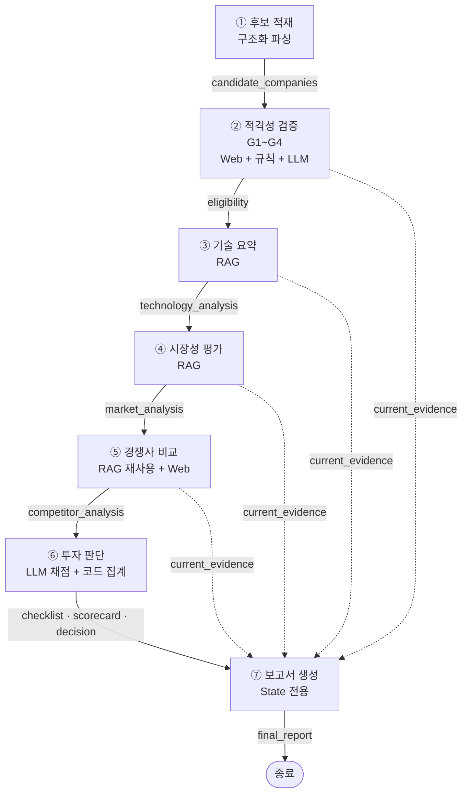
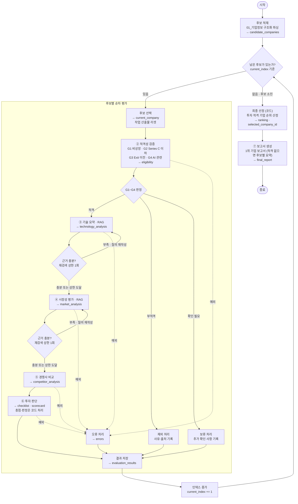

팀원 : 김세령, 김현수, 박세웅, 박인우, 성재원

---

# Domain 선정

**Semiconductor (반도체)**

평가 후보 기업은 창업진흥원 「2025년 초격차 스타트업 1000+ 프로젝트 디렉토리북」 1권 중 **시스템반도체 분야에 수록된 45개사**로 한정한다.

가이드의 Semiconductor 도메인 정의("AI 연산에 특화된 칩을 설계하거나, AI로 반도체 제조 공정을 개선하는 기술")를 **자격 요건 G4(AI 관련성)** 로 그대로 수용한다. 따라서 범용 전력·아날로그 반도체 기업과 AI를 수식어로만 사용하는 기업은 후보에서 제외한다.

후보는 아래 **4개 자격 요건(G1~G4)** 을 모두 통과해야 평가 대상이 된다. 상세 기준은 「투자 판단 기준 › 2. 자격 요건」에 있다.

| 요건          | 내용                           |
| ------------- | ------------------------------ |
| **G1 비상장** | 코스피·코스닥 상장사가 아닐 것 |

| **G2 Series C 이
하** | 최신 투자 단계가 Seed~Series C일 것 |
| **G3 Exit 이전** | M&A 등으로 Exit이 완료되지 않았을 것 |
| **G4 AI 관련** | 메인 아이템이 AI 연산 칩, AI 워크로드 가속, AI 기반 공정 개선 중 하나일 것 |

---

# 설계

## 0. 문서 코퍼스 실측

설계 판단의 근거가 되므로, 구성한 RAG 문서 15개를 먼저 실측했다. 전 파일 `pdftotext -layout` 전문 추출 후 집계하였다.

| 파일               | 페이지  | 자/페이지  | 한글%    | 숫자%   | 표라인%  | 용도         |
| ------------------ | ------- | ---------- | -------- | ------- | -------- | ------------ |
| 01\_기업정보       | 47      | 1,919      | **63.9** | 8.8     | **25.0** | 후보 적재    |
| 02*AI*컴퓨팅       | 11      | 2,579      | 0.0      | 1.3     | 5.7      | 기술         |
| 03\_패키징         | 6       | 2,950      | 0.0      | 0.9     | 0.0      | 기술         |
| 04\_전력전자       | 8       | 1,641      | 0.0      | 9.0     | **29.7** | 기술         |
| 05*RF*센서         | 12      | 3,354      | 0.0      | 1.6     | 0.0      | 기술         |
| 06\_메모리         | 6       | 3,601      | 0.0      | 1.5     | 0.0      | 기술         |
| 07_UCIe_3.0        | 6       | 2,160      | 0.0      | 1.0     | 0.0      | 기술         |
| 08_CXL_4.0         | 3       | 1,468      | 0.0      | 1.5     | 0.0      | 기술         |
| 09*소재*소자       | 9       | **3,862**  | 0.0      | 1.5     | 0.2      | 기술         |
| 10\_계측           | 11      | 3,624      | 0.0      | 1.5     | 0.2      | 기술         |
| 11*수율*검사       | 4       | 3,225      | 0.0      | 1.2     | 7.1      | 기술         |
| 12\_글로벌시장     | 19      | 1,133      | 0.0      | 4.6     | 1.6      | 시장         |
| 13*WSTS*시장전망   | 2       | 1,221      | 0.0      | 5.9     | 0.0      | 시장         |
| 14*한국*반도체시장 | 12      | **654**    | **78.8** | 8.5     | 6.7      | 시장         |
| 15*산업구조*경쟁   | 13      | 2,872      | 0.0      | 1.8     | 0.0      | 시장·경쟁    |
| **합계**           | **169** | 평균 2,280 | **16.6** | **3.8** | —        | 200p 한도 내 |

**실측에서 확인된 4가지 — 이후 모든 설계 판단의 근거가 된다.**

**(1) 언어가 섞여 있지 않고 분리되어 있다.**

한글은 01·14 **두 파일(59p)에만** 존재하고, 나머지 13개 파일 **110p는 한글 0.0%인 영문 전용**이다. 평가표의 질의는 한국어로 생성되므로, 본 시스템의 실제 검색 부담은 "다국어 혼재"가 아니라 **한국어 질의 → 영문 문서 교차언어 검색(전체의 65%)** 이다.

**(2) 01\_기업정보는 1페이지 = 1기업이며, 45개사가 정확히 일치한다.**

페이지별 첫 줄을 추출해 기업명 45건을 확인했다. 나머지 2페이지(16·20쪽)는 **텍스트가 0자인 이미지 전용 페이지**(884×3350 세로 배너)로, 텍스트 로더로는 아무 내용도 추출되지 않는다. 따라서 실질 텍스트 페이지는 167p이다.

다만 이 문서는 **다단 펼침면**이라 레이아웃 보존 추출 시 컬럼이 뒤섞인다. 실제 추출 결과에서 좌측 본문 "서버 구조의 한계를 넘어,"와 우측 항목 "사업 Point 차세대 DPU 솔루션을…"이 한 줄로 병합되어 나온다.

**(3) 12·14는 차트 중심이다.**

각각 1,133 / 654 자/페이지로 코퍼스 평균(2,280)의 절반 이하다. 텍스트 레이어만 사용하면 그래프 안의 시장 수치가 상당수 누락된다.

**(4) 숫자·식별자 밀도가 3.8%다.**

특허 등록번호(`10-2532099`), 성능 지표(TOPS/W, `128 GT/s`), 매출액(`21,818천원`), TRL 등급, 기업명·제품명이 여기에 해당한다. 평가표 16개 세부 항목 중 상당수가 이런 **정확일치 토큰**을 직접 요구한다.

## 1. 에이전트 정의

### 1-1. 파이프라인 개요

가이드의 에이전트 정의(안) 6종을 본 도메인에 맞게 재정의하고, 후보 적재 단계를 분리하여 **7개 에이전트**로 구성한다.

> 가이드의 "🔍 스타트업 탐색 에이전트(RAG O)"는 본 설계에서 **① 후보 적재 + ② 적격성 검증** 두 단계로 분리된다. 후보 모집단이 디렉토리북 45개사로 고정되어 있어 "탐색"이 아니라 "정형 적재 + 자격 필터"가 실제 수행 내용이기 때문이다.



점선은 근거 전달 경로다. 모든 에이전트는 확보한 근거를 `current_evidence`에 근거 ID와 함께 적재하고, 보고서 생성 에이전트는 본문의 모든 수치를 이 ID로 참조한다.

### 1-2. 에이전트별 입출력 계약

각 에이전트가 **무엇을 읽고 → 어떤 기술로 → 무엇을 모아 → 무엇을 쓰고 → 누구에게 넘기는지**를 정의한다.

---

#### ① 후보 적재 에이전트 (전처리, 그래프 진입 전 1회)

| 항목                                                                                                                                                                                                                               | 내용                                                                                                                                                                                                                          |
| ---------------------------------------------------------------------------------------------------------------------------------------------------------------------------------------------------------------------------------- | ----------------------------------------------------------------------------------------------------------------------------------------------------------------------------------------------------------------------------- |
| **입력**                                                                                                                                                                                                                           | `source_document`                                                                                                                                                                                                             |
| **수집 기술**                                                                                                                                                                                                                      | 블록 좌표(bbox) 단위 PDF 파싱 → 좌표로 컬럼 복원 → LLM 구조화 추출(스키마 고정 출력)                                                                                                                                          |
| **수집 대상**                                                                                                                                                                                                                      | `01_기업정보.pdf` 45개 텍스트 페이지 (16·20쪽 이미지 전용 제외)                                                                                                                                                               |
| **왜 청킹하지 않는가**                                                                                                                                                                                                             | 1페이지=1기업이고, 다단 펼침면이라 문자 단위 청킹 시 서로 다른 컬럼의 문장이 한 청크에 섞인다. 또한 평가표의 📘 표시 항목 전부가 이 문서의 **특정 필드**를 직접 가리키므로, 자유 텍스트 검색보다 필드 조회가 설계와 정합한다. |
| **출력**                                                                                                                                                                                                                           | `candidate_companies: list[dict]` — 기업당 15개 필드                                                                                                                                                                          |
| `company_id, 기업명, 홈페이지, 설립일, 대표자명, 직원수, 업종/업태, 기술분야, 메인아이템, 주요구성원, 주요재무현황(매출액 국내/해외), 투자유치이력, 지식재산권, 인증·수상, 주요거래처, 개발진척도, 혁신성, 사업Point, source_page` |
| **다음**                                                                                                                                                                                                                           | ② 적격성 검증 (순차 조회), ⑥ 투자 판단 (📘 근거 필드), ⑦ 보고서 (1장 기업 개요)                                                                                                                                               |

---

#### ② 투자 대상 적격성 검증 에이전트

**4개 자격 요건(G1~G4)을 각각 어떻게 판정하는가** — 하나라도 미충족이면 제외한다.

| 요건                 | 판정 방식 | 무엇을 보고 판정하는가                                                               |
| -------------------- | --------- | ------------------------------------------------------------------------------------ |
| **G1** 비상장        | 규칙      | DART에 종목코드가 존재하는지                                                         |
| **G2** Series C 이하 | 규칙      | 최신 투자 라운드 뉴스. Pre-A·브릿지 등 중간 라운드는 직전 단계 기준                  |
| **G3** Exit 이전     | 규칙      | 인수·합병 뉴스 존재 여부                                                             |
| **G4** AI 관련       | **LLM**   | 디렉토리북의 메인 아이템·사업 Point. 유일하게 판단이 개입하므로 규칙이 아닌 LLM 판정 |

| 항목                                                 | 내용                                                                                                                                                                           |
| ---------------------------------------------------- | ------------------------------------------------------------------------------------------------------------------------------------------------------------------------------ | ------ | --------------------------------------------- |
| **입력**                                             | `current_company`, `as_of_date`                                                                                                                                                |
| **수집 기술**                                        | 웹서치 툴 + 규칙 판정(G1~G3) + LLM 판정(G4)                                                                                                                                    |
| **수집 대상**                                        | DART 공시, 투자 라운드 뉴스, M&A 뉴스 — **외부 웹. RAG 미사용**                                                                                                                |
| **왜 RAG를 쓰지 않는가**                             | G1~G3은 `as_of_date` 시점의 **최신 상태**를 판정해야 한다. RAG 코퍼스는 2025년 디렉토리북이므로 현재 상태를 확정할 수 없다. G4만 디렉토리북의 메인 아이템 필드로 판정 가능하다 |
| **출력**                                             | `eligibility: dict` — `{판정: 적격                                                                                                                                             | 부적격 | 확인필요, G1~G4 조건별 결과, 사유, 근거ID[]}` |
| `decision`(부적격·확인필요 시), `current_evidence[]` |
| **다음**                                             | 적격 → ③ 기술 요약 / 부적격 → 제외 / 확인필요 → 보류                                                                                                                           |

---

#### ③ 기술 요약 에이전트 **[RAG]**

| 항목                 | 내용                                                                                                                                                          |
| -------------------- | ------------------------------------------------------------------------------------------------------------------------------------------------------------- |
| **입력**             | `current_company`(메인아이템·기술분야·혁신성·개발진척도)                                                                                                      |
| **수집 기술**        | **bge-m3 하이브리드 검색** — dense(Chroma) + sparse 결과를 RRF로 융합, top-k=5                                                                                 |
| **수집 대상**        | `02~11` 기술 문서 **76p**. 메타데이터 필터 `doc_type="tech"` 및 기업 기술분야에 대응하는 세부 분야로 범위 축소                                                |
| **검색 질의 생성**   | 기업의 메인 아이템·핵심 지표를 질의로 변환. 근거 부족 시 질의를 수정해 **최대 1회 재검색**(상한 상수 `N_RETRIEVE_RETRY = 1`), 이후에도 미확인이면 `확인 불가` |
| **판단 내용**        | 기업이 주장하는 성능 수치를 IRDS·UCIe·CXL 등 **업계 로드맵의 기준값과 대조**하여 경쟁력을 평가. 측정 조건과 검증 수준을 반드시 확인                           |
| **출력**             | `technology_analysis: dict` — `{핵심기술, 제품성숙도(TRL), 성능지표{지표명, 값, 측정조건, 검증수준}, 강점[], 한계[], 미확인정보[], 근거ID[]}`                 |
| `current_evidence[]` |
| **다음**             | ④ 시장성 평가, ⑤ 경쟁사 비교, ⑥ 투자 판단(C1·C2·C3 채점), ⑦ 보고서(2.1)                                                                                       |

---

#### ④ 시장성 평가 에이전트 **[RAG]**

| 항목                 | 내용                                                                                                                                             |
| -------------------- | ------------------------------------------------------------------------------------------------------------------------------------------------ |
| **입력**             | `current_company`(사업Point·주요거래처·매출액), `technology_analysis`                                                                            |
| **수집 기술**        | **bge-m3 하이브리드 검색** (③과 동일 인덱스, 필터만 상이)                                                                                        |
| **수집 대상**        | `12~15` 시장 문서 **46p**. 필터 `doc_type="market"`                                                                                              |
| **판단 내용**        | 목표 고객·시장 규모·성장률·수요처·진입장벽을 SIA/WSTS/KIET/OECD 자료에서 확인. 기업이 제시한 시장 주장과 **대조**                                |
| **출력**             | `market_analysis: dict` — `{목표고객, 시장규모{값, 출처, 기준연도}, 성장률, 사업모델, 글로벌확장성, 성장요인[], 위험[], 미확인정보[], 근거ID[]}` |
| `current_evidence[]` |
| **다음**             | ⑤ 경쟁사 비교, ⑥ 투자 판단(B1·B2·B3 채점), ⑦ 보고서(2.2, 3.3)                                                                                    |

---

#### ⑤ 경쟁사 비교 에이전트 **[RAG 재사용 — 신규 인덱스 없음]**

| 항목          | 내용                                                                                                                                                                                                                                                                           |
| ------------- | ------------------------------------------------------------------------------------------------------------------------------------------------------------------------------------------------------------------------------------------------------------------------------ |
| **입력**      | `technology_analysis`, `market_analysis`, `current_company`                                                                                                                                                                                                                    |
| **수집 기술** | ③·④가 구축한 **기존 인덱스를 재조회**(신규 문서·신규 인덱스 없음) + 웹서치로 실제 경쟁 제품 스펙 확보                                                                                                                                                                          |
| **수집 대상** | `02~11`(비교 기준이 되는 업계 지표) + `15_산업구조_경쟁`(산업 내 위치·진입장벽) + Web(개별 경쟁 제품)                                                                                                                                                                          |
| **RAG 여부**  | **재사용 (신규 문서·신규 인덱스 없음).** 경쟁사 비교에만 필요한 문서를 따로 추가하지 않는다. 비교의 기준이 되는 업계 지표는 이미 기술 인덱스에, 산업 내 위치는 `15_산업구조_경쟁`에 있으므로 이를 다시 조회하는 것으로 충분하다. 개별 경쟁 제품의 최신 스펙만 웹에서 보완한다. |
| **출력**      | `competitor_analysis: dict` — `{경쟁제품[]{기업명, 제품, 핵심지표값, 출처}, 비교표, 우위[], 열위[], 비교조건, 비교한계, 근거ID[]}`                                                                                                                                             |
| **다음**      | ⑥ 투자 판단(D2 채점), ⑦ 보고서(2.3, 3.3)                                                                                                                                                                                                                                       |

---

#### ⑥ 투자 판단 에이전트

| 항목              | 내용                                                                                                                        |
| ----------------- | --------------------------------------------------------------------------------------------------------------------------- | ------- | --- | ------------------------ |
| **입력**          | `current_company`, `eligibility`, `technology_analysis`, `market_analysis`, `competitor_analysis`, `evaluation_criteria`    |
| **수집 기술**     | 신규 수집 없음. **LLM은 항목별 점수·근거·출처만 출력**하고, 가중 합산과 최종 판정은 **코드로 처리**                         |
| **왜 분리하는가** | LLM이 총점을 계산하면 동일 입력에 대해 판정이 흔들린다. 산술과 임계 판정을 코드로 고정해야 45개사에 일관된 기준이 적용된다. |
| **출력**          | `checklist: dict` — 11문항 `{판정: YES                                                                                      | PARTIAL | NO  | 확인불가, 근거, 근거ID}` |

`scorecard: dict` — 16개 세부 항목 `{점수(1~5), 채점이유, 근거ID}`, 대분류 평균, 총점
`decision: Literal["투자 적격","보류","제외"]`, `decision_details: dict` |
| **다음** | 결과 저장 → 다음 후보 (투자 적격이어도 루프 계속). 전체 평가 후 최종 선정 노드가 순위 산정 |

---

#### ⑦ 보고서 생성 에이전트

| 항목          | 내용                                                                                                                                                                                                                                         |
| ------------- | -------------------------------------------------------------------------------------------------------------------------------------------------------------------------------------------------------------------------------------------- |
| **입력**      | `evaluation_results`, `selected_company_id`, `ranking`, `source_document`, `as_of_date`                                                                                                                                                      |
| **수집 기술** | 신규 검색·신규 근거 생성 **금지**. State에 저장된 내용만 사용. 선정 기업의 기업정보·분석·점수·근거는 `evaluation_results`에서 `selected_company_id`로 조회한다 (루프가 끝까지 돌기 때문에 `current_*` 필드에는 마지막 후보의 값이 남아 있음) |
| **제약**      | 자료 부족을 추정으로 대체하지 않고 `확인 불가`로 기재. 본문의 모든 수치에 근거 ID를 연결. REFERENCE에는 **실제 인용된 근거 ID의 출처만** 기재                                                                                                |
| **출력**      | `final_report: str` — SUMMARY + 3장 + REFERENCE (5장 이내)                                                                                                                                                                                   |
| **다음**      | 종료                                                                                                                                                                                                                                         |

## 2. RAG 적용

### 2-1. 적용 대상과 범위

**기술 요약·시장성 평가 두 에이전트에 RAG를 적용**하고, 경쟁사 비교는 동일 인덱스를 재사용한다. 기업별 기술 주장과 시장 수치를 원문에서 검색해 분석하고, 그 근거를 최종 보고서까지 ID로 연결하기 위함이다.

| 구분              | 실제 문서                                                    | 편입 범위                   | 페이지  | 주 사용 Agent       |
| ----------------- | ------------------------------------------------------------ | --------------------------- | ------- | ------------------- |
| 기업정보          | 2025 초격차 스타트업 1000+ 디렉토리북 1권                    | 6~52p, 시스템반도체 45개사  | **47**  | 후보 적재 / 전체    |
| AI·컴퓨팅         | IEEE IRDS 2024 – More Moore                                  | 5~7, 15~22p                 | 11      | Technology          |
| AI·컴퓨팅         | IEEE IRDS 2024 – Executive Packaging Tutorial Part 2         | 9~14p                       | 6       | Technology          |
| 아날로그·전력     | APC / Automotive Council UK – Power Electronics Roadmap 2024 | 4~7, 9~12p                  | 8       | Technology          |
| RF·센서           | IEEE IRDS 2024 – Outside System Connectivity                 | 12~13, 23~28, 31~32, 39~40p | 12      | Technology          |
| 메모리            | IEEE IRDS 2024 – More Moore: Memory Technologies             | 27~32p                      | 6       | Technology          |
| 인터페이스·IP     | UCIe Consortium – UCIe 3.0 White Paper                       | 전체                        | 6       | Technology          |
| 인터페이스·메모리 | CXL Consortium – CXL 4.0 White Paper                         | 전체                        | 3       | Technology          |
| 소재·소자         | IEEE IRDS 2024 – Beyond CMOS                                 | 80~85, 88~90p               | 9       | Technology          |
| 공정·검사         | IEEE IRDS 2024 – Metrology                                   | 10~13, 43~49p               | 11      | Technology          |
| 공정·검사         | IEEE IRDS 2024 – Yield Enhancement                           | 27~30p                      | 4       | Technology          |
| 글로벌 시장       | SIA – 2026 State of the U.S. Semiconductor Industry          | 4~22p                       | 19      | Market              |
| 시장 전망         | WSTS – Spring 2026 Semiconductor Market Forecast             | 전체                        | 2       | Market              |
| 한국 시장         | KIET – 2026년 하반기 경제·산업 전망: 반도체산업              | 제10장 (134~145p)           | 12      | Market              |
| 산업구조·경쟁     | OECD – Mapping the Semiconductor Value Chain (2025)          | 6~18p                       | 13      | Market / Competitor |
|                   |                                                              | **실측 합계**               | **169** | 200p 한도 내        |

각 문서의 추출 페이지와 원본 페이지는 1:1 대응표로 관리하며, 이 대응이 보고서 REFERENCE의 페이지 표기 근거가 된다.

### 2-2. 문서군별 차등 처리

실측 결과 문서 특성이 균질하지 않으므로, **단일 청킹 전략을 전체에 적용하지 않는다.**

| 문서군                    | 처리 방식                                                                                                                                       | 실측 근거                                                                                                                                                            |
| ------------------------- | ----------------------------------------------------------------------------------------------------------------------------------------------- | -------------------------------------------------------------------------------------------------------------------------------------------------------------------- |
| **01\_기업정보** (47p)    | 청킹하지 않음. 블록 좌표 기반 파싱으로 컬럼을 복원한 뒤 **1페이지 = 1기업 = 1레코드**로 15개 필드를 구조화 추출. 기업 ID를 메타데이터 키로 사용 | 다단 펼침면 → 컬럼 뒤섞임 확인 / 1p=1기업 45건 확인 / 평가표 📘 항목이 전부 특정 필드를 지목 / 문자 청킹 시 1기업이 3~4청크로 분할되어 top-5가 한 기업 내에서 소진됨 |
| **02~11 기술문서** (76p)  | 표준 청킹. 단일 컬럼이라 추출 순서가 정상임을 확인                                                                                              | 추출 결과 문단 순서 정상                                                                                                                                             |
| **12·14 차트 중심** (31p) | 표·캡션 보존 파싱. 그래프 내부 수치 누락 가능성을 **보고서 한계점에 기재**                                                                      | 1,133 / 654 자·페이지 (평균 2,280의 절반 이하)                                                                                                                       |
| **01·04 표 밀집**         | 표 라인 보존 파싱. 헤더·단위·측정 조건을 값과 분리하지 않음                                                                                     | 표라인 비율 25.0% / 29.7%                                                                                                                                            |
| **16·20쪽**               | 로딩 대상에서 **명시적 제외**                                                                                                                   | 텍스트 0자 이미지 전용 페이지                                                                                                                                        |

### 2-3. 청킹 파라미터

| 항목           | 값                                                                       | 근거                                                                                                                                  |
| -------------- | ------------------------------------------------------------------------ | ------------------------------------------------------------------------------------------------------------------------------------- |
| 분할기         | 재귀적 문자 분할 (문단 → 줄 → 문장 순으로 경계를 찾음)                   | **분할 단위는 토큰이 아니라 문자다.** 토큰 수는 언어에 따라 3배 가까이 달라져 문서군 간 청크 크기가 들쭉날쭉해진다                    |
| 청크 크기      | **700자**                                                                | 표 라인이 25~30%인 문서에서 헤더·단위·값이 서로 다른 청크로 갈리지 않을 만큼의 여유. 일반적 기준선(500자)보다 확대                    |
| 중첩           | **100자**                                                                | 문단 경계를 넘어가는 수치 설명을 양쪽 청크에 모두 남기기 위함                                                                         |
| 512토큰 적합성 | 영문 700자 ≈ 175토큰 / 한글 700자 ≈ 470토큰 (XLM-R 계열 토크나이저 추정) | 두 후보 모델의 **공통 상한 512토큰 이내**. 비교 실험을 동일 조건에서 수행하기 위한 제약이기도 함                                      |
| top-k          | **5**                                                                    | 검색 결과를 보고서에 근거 ID로 직접 인용하므로 재현율보다 **정밀도**가 중요하다. k를 늘리면 관련성이 낮은 청크가 근거로 섞여 들어간다 |
| 재검색         | **최대 1회** (`N_RETRIEVE_RETRY = 1`)                                    | 상한을 State 카운터로 관리                                                                                                            |

> 위 토큰 환산은 문자/토큰 비율에 의한 추정치다. 구현 단계에서 `AutoTokenizer`로 실제 분포를 측정하고, 512토큰을 초과하는 청크가 발생하면 문서군별로 청크 크기를 하향 조정한다.

### 2-4. 검색 범위와 근거 관리

| 구분              | 처리 과정                                                                       |
| ----------------- | ------------------------------------------------------------------------------- |
| **사전 준비**     | 문서 수집 → 레이아웃 인지 파싱 → 청킹 / 구조화 추출 → 임베딩 → 벡터 저장소 저장 |
| **에이전트 실행** | 검색 질의 생성 → 하이브리드 검색 → 근거 확인 → (부족 시 1회 재검색) → 분석 생성 |

**메타데이터 스키마**

`doc_id, doc_type(company|tech|market), sub_domain, company_id, title, publisher, pub_year, source_type, url, source_page, output_page`

- `doc_type`·`sub_domain`으로 에이전트별 검색 범위를 제한한다.
- `publisher` · `pub_year` · `source_type`은 **보고서 REFERENCE를 가이드 표기 형식으로 자동 생성**하기 위한 필드다.

**근거 레코드**

`{근거ID, 출처명, publisher, pub_year, source_type, url, source_page, 확인일, 원문 발췌}`

분석 결과는 근거 ID를 참조하고, 그 ID가 투자 판단의 채점 근거와 보고서 본문 출처로 이어진다.

## 3. Embedding 모델 선정

### 3-1. 요구조건 도출

리더보드 순위가 아니라 **2-0에서 실측한 코퍼스 특성**에서 요구조건을 도출한다.

| #      | 요구조건                                  | 도출 근거 (실측)                                                          |
| ------ | ----------------------------------------- | ------------------------------------------------------------------------- |
| **R1** | 한국어 질의 ↔ 영문 문서 **교차언어 정렬** | 영문 전용 110p(전체의 65%), 한글은 59p에 분리 집중. 평가표 질의는 한국어  |
| **R2** | 숫자·식별자 **정확일치** 검색             | 숫자 밀도 3.8%. 특허 등록번호, TOPS/W, 128 GT/s, 매출액, TRL 등급, 제품명 |
| **R3** | 표 구조 텍스트 내성                       | 표 라인 비율 01=25.0%, 04=29.7%                                           |
| **R4** | 청크 512토큰 이하로 **충분**              | 최대 3,862자/페이지 문서도 700자 청크로 분할 → 최대 약 470토큰            |
| **R5** | **오픈소스 자체 호스팅**                  | 과제 필수 요건                                                            |

### 3-2. 후보 스크리닝 (4종 → 2종)

| 후보                                         | 판정          | 사유                                                                                                                                                                                                                         |
| -------------------------------------------- | ------------- | ---------------------------------------------------------------------------------------------------------------------------------------------------------------------------------------------------------------------------- |
| `jhgan/ko-sroberta-multitask` 등 한국어 전용 | **탈락**      | **R1 불충족.** 한국어 문장 유사도에는 강하나 영문 문서와의 교차언어 정렬이 정의되지 않는다. 본 코퍼스의 65%가 영문이므로 치명적                                                                                              |
| `Qwen3-Embedding-0.6B` 등 최신 대형 다국어   | **탈락**      | R1·R2를 충족할 수 있으나 로컬 실행 환경(CPU/MPS) 대비 모델 규모가 과다하다. 또한 이 후보의 선택 근거는 "성능이 가장 높아서"로 수렴하는데, **그것은 본 코퍼스를 보지 않고도 할 수 있는 판단**이므로 선정 기준으로 삼지 않는다 |
| `intfloat/multilingual-e5-base`              | **최종 후보** | R1·R3·R4·R5 충족. **R2 취약**(dense 단독)                                                                                                                                                                                    |
| `BAAI/bge-m3`                                | **최종 후보** | R1·R2·R3·R5 충족. **R4는 초과 충족**(사용하지 않는 여력)                                                                                                                                                                     |

### 3-3. 최종 2종 비교 — 요구조건 축

|                  | `multilingual-e5-base`                             | `BAAI/bge-m3`                              |
| ---------------- | -------------------------------------------------- | ------------------------------------------ |
| 배포 ID          | `intfloat/multilingual-e5-base`                    | `BAAI/bge-m3`                              |
| 백본             | XLM-RoBERTa base 계열 (약 2.8억 파라미터)          | XLM-RoBERTa large 계열 (약 5.7억 파라미터) |
| 임베딩 차원      | 768                                                | 1,024                                      |
| 최대 입력        | 512 토큰                                           | 8,192 토큰                                 |
| 검색 방식        | Dense                                              | **Dense · Sparse · Multi-vector**          |
| **R1 교차언어**  | ○ 다국어 대조학습, `query:`/`passage:` 접두어 필요 | ○ 다국어 100종 이상, 접두어 불필요         |
| **R2 정확일치**  | **△ Dense 단독.** 별도 BM25 결합 필요              | **○ Sparse(lexical weight) 헤드 내장**     |
| **R3 표 내성**   | ○                                                  | ○                                          |
| **R4 청크 길이** | ○ 512로 충분                                       | **△ 8,192는 본 설계에서 미사용**           |
| **R5 오픈소스**  | ○                                                  | ○                                          |

출처: Multilingual E5 Base 공식 모델 카드, BGE-M3 공식 모델 카드

### 3-4. 선정 : `BAAI/bge-m3`

**근거 ①. R2가 두 후보를 가르는 유일한 축이며, 본 코퍼스에서 R2의 비중이 크다.**

bge-m3의 sparse 표현은 토큰별 가중치(lexical weight)를 학습하여, 질의와 문서에 **공통으로 등장한 토큰**의 가중치 곱을 합산해 점수를 낸다. 즉 유사어로 질의를 넓히는 능력은 약한 대신, **출현한 토큰의 정확 매칭에 강한** "가중치를 학습한 BM25"에 가까운 거동이다.

**본 코퍼스가 요구하는 것이 정확히 이 거동이다.** `10-2532099`(특허 등록번호), `128 GT/s`, `TOPS/W`, `21,818천원` 같은 토큰은 유사어로 확장될 여지가 없고 오직 그 자체로 매칭되어야 한다. 의미적 유사성은 dense 쪽이 담당하므로, sparse의 "확장이 약하다"는 특성은 본 설계에서 단점으로 작용하지 않는다.

e5-base로 동일한 수준에 도달하려면 Kiwi 형태소 BM25를 별도로 붙여야 하고, 그 경우 **형태소 분석기 의존성과 2계통 인덱스를 추가로 관리**해야 한다. bge-m3는 이를 단일 모델 안에서 해결한다.

**근거 ②. R1을 단일 인덱스로 처리한다.**

dense가 한국어 질의 → 영문 문서 정렬(110p 구간)을, sparse가 고유명사·수치 매칭을 담당하여, 영문 110p와 한글 59p를 하나의 인덱스로 커버한다. 언어별로 인덱스를 나누면 교차언어 검색 자체가 불가능해지므로 단일 인덱스가 전제이며, 그 전제에서 두 검색 방식을 동시에 제공하는 모델이 유리하다.

**근거 ③. R4는 초과 충족이며, 이를 감추지 않고 명시한다.**

**bge-m3의 8,192토큰 입력 창은 본 설계에서 사용하지 않는다.** 700자 청킹 기준 최대 약 470토큰이므로 512조차 넘지 않는다. 즉 우리는 모델 능력의 일부를 쓰지 않는 상태로 채택하는 것이고, 이는 명백한 trade-off다. 그럼에도 채택하는 이유는 선정이 **R2에서 결정되며 R4에서는 결정되지 않기** 때문이다. 긴 입력이 필요한 설계였다면 이 축이 근거가 되었겠지만, 본 설계는 그렇지 않다.

**근거 ④. 비용은 본 코퍼스 규모에서 선정 기준이 될 수 없다 — 그래서 기준에서 제외했다.**

| 항목               | e5-base (768d)  | bge-m3 (1,024d) | 차이           |
| ------------------ | --------------- | --------------- | -------------- |
| 벡터 수            | 835 (실측)      | 835 (실측)      | —              |
| 인덱스 용량 (fp32) | 약 2.4 MiB      | 약 3.3 MiB      | **약 0.8 MiB** |
| 외부 API 비용      | 0 (자체 호스팅) | 0 (자체 호스팅) | **0**          |

벡터 수는 청킹 대상 문서(02~15)를 페이지 단위로 700자·중첩 100자 분할한 790청크에, 구조화 추출한 기업 레코드 45건을 더한 실측값이다 (설계 시 추정 627).

인덱스 용량 차이는 **1 MiB 미만**이고, 두 후보 모두 오픈소스 자체 호스팅이라 API 호출 비용은 양쪽 모두 0이다. 비용이 실제 선정 기준이 되려면 문서가 수천 페이지 이상이거나 재색인이 빈번해야 하는데, 본 과제는 169페이지를 1회 색인하는 규모라 그 임계에서 멀다.

**따라서 벡터 차원 수와 모델 크기는 선정 기준에서 의도적으로 제외했다.** 이 규모에서 경량 모델을 택하는 것은 절약이 아니라 **R2를 포기하는 선택**이 된다.

### 3-5. 적용 전략

| 항목        | 내용                                                                                                                                              |
| ----------- | ------------------------------------------------------------------------------------------------------------------------------------------------- |
| 벡터 저장소 | Chroma (`langchain-chroma`). 문서 내용 해시가 같으면 기존 인덱스를 재사용해 재색인을 건너뜀. 당초 FAISS였으나 torch(bge-m3)와 OpenMP 런타임이 충돌해 macOS에서 프로세스가 종료되어 교체 (docs/TROUBLESHOOTING.md) |
| 검색기 구성 | dense 검색(Chroma)과 sparse 검색(bge-m3 lexical weight)을 각각 수행한 뒤 **RRF(Reciprocal Rank Fusion)** 로 순위를 융합. 초기 가중치는 `0.5 : 0.5` |
| 유사도      | 정규화 임베딩 코사인 유사도                                                                                                                       |
| 검색 범위   | 메타데이터 필터(`doc_type`, `sub_domain`, `company_id`)로 에이전트별 축소 후 검색                                                                 |
| 가중치 튜닝 | 3-6 측정 결과에 따라 sparse 가중치를 조정 → 실측: sparse 상향(0.4:0.6) 시 MRR@5 0.917→0.833 하락, dense 상향은 1문항 차이라 **0.5:0.5 유지** |

### 3-6. 검증 계획

**선정은 요구조건과 공식 사양에 근거한 설계 판단이며, 구현 단계에서 실측으로 확인한다.**

**골든셋 18문항** — 질문과 그 답이 들어 있는 정답 청크를 미리 짝지어 둔 평가용 질의 집합이다. **구성 비율은 코퍼스 분포에서 도출한다.**

| 질의 유형                              | 문항 | 배정 근거                          |
| -------------------------------------- | ---- | ---------------------------------- |
| 교차언어 (한국어 질의 → 영문 기술문서) | 8    | 영문 전용 110p = 코퍼스의 65%      |
| 숫자·식별자 정확일치                   | 5    | 숫자 밀도 3.8%, 평가표가 직접 요구 |
| 한국어 기업정보 조회                   | 3    | 01\_기업정보 47p                   |
| 표 내부 수치                           | 2    | 표 라인 25~30% 문서                |

**측정 항목**

| 지표                                | 정의                                                                 | 보는 이유                                                       |
| ----------------------------------- | -------------------------------------------------------------------- | --------------------------------------------------------------- |
| `Hit Rate@K`                        | 상위 K개 검색 결과 안에 정답 청크가 포함된 질의의 비율 (K = 1, 3, 5) | top-k=5로 운영하므로 `@5`가 실제 운영 조건, `@1`은 1순위 정확도 |
| `MRR@5`                             | 정답 청크가 등장한 순위의 역수 평균                                  | 정답을 찾았는지뿐 아니라 **몇 번째로** 찾았는지를 반영          |
| 색인 시간 · 질의 지연 · 인덱스 용량 | —                                                                    | 45개사를 순차 평가하므로 질의 지연이 전체 실행 시간에 누적      |

정답 판정은 검색된 청크가 정답 청크와 **30% 이상 겹치는지**로 하고, 난수 시드를 고정해 비교군 간 조건을 동일하게 맞춘다.

**비교군 4개 — 이것이 곧 선정 근거 ①의 가설 검증이다**

| #   | 구성                                            | 확인 대상                                 |
| --- | ----------------------------------------------- | ----------------------------------------- |
| 1   | bge-m3 dense 단독                               | 하이브리드의 순수 이득 분리               |
| 2   | **bge-m3 dense + sparse (채택안)**              | —                                         |
| 3   | e5-base dense 단독                              | 경량 dense 단독 기준선                    |
| 4   | e5-base + BM25 앙상블 (한국어 형태소 분석 적용) | 정확일치를 외부 BM25로 보완하는 대안 경로 |

**번복 조건.** ②가 ①·③ 대비 `MRR@5` 개선을 보이지 못하면 **선정 근거 ①이 성립하지 않는 것**이므로, 더 가벼운 ③(e5-base)으로 회귀하고 본 설계를 갱신한다. 반대로 ②와 ④의 차이가 미미하다면 sparse의 이점이 외부 BM25로 대체 가능하다는 뜻이므로, 의존성이 적은 쪽을 택한다.

즉 이 측정은 성능 확인이 아니라 **선정 논리 자체를 반증 가능한 형태로 만들기 위한 것**이다. 측정 결과는 개발 산출물 README의 검색 성능 항목에 기재한다.

**측정 결과** (골든셋 18문항, 835청크, top-k 5 — `eval/results.md`)

| # | 구성 | Hit@1 | Hit@5 | MRR@5 | 정확일치 MRR@5 |
| --- | --- | --- | --- | --- | --- |
| 1 | bge-m3 dense | 0.778 | 1.000 | 0.852 | 0.750 |
| 2 | **bge-m3 dense + sparse (채택)** | **0.889** | 0.944 | **0.917** | **1.000** |
| 3 | e5-base dense | 0.722 | 0.833 | 0.778 | 0.600 |
| 4 | e5-base + BM25 (Kiwi) | 0.722 | 0.778 | 0.750 | 0.600 |

**판정.** ②가 ①·③ 대비 MRR@5를 개선했고 ④와의 차이도 커 **선정 근거 ① 성립, bge-m3 유지**. 개선은 정확일치(0.750→1.000)에서 나와 R2 가설과 일치한다. ②가 놓친 1문항은 한국어 질의가 유일한 한국어 시장 문서(KIET)로 쏠린 경우로, 질의에 영문을 병기하면 정답이 복귀한다 → 에이전트 질의는 한·영 병기.

---

# 투자 판단 기준

## 1. 설계 개요

**설계 목적**

- 반도체 도메인 AI 스타트업의 투자 가능성을 일관된 기준으로 판정하는 평가 체계를 정의한다.
- 가이드의 Bessemer Checklist와 Scorecard Method를 기반으로, 반도체 딥테크 특성과 **활용 가능한 자료의 범위**에 맞게 항목과 가중치를 조정한다.

**평가 흐름**

| 단계 | 구분                | 역할                                                | 결과                                                           |
| ---- | ------------------- | --------------------------------------------------- | -------------------------------------------------------------- |
| ①    | 자격 요건 (G1~G4)   | 과제에서 정의한 스타트업 조건 충족 여부 확인        | 미충족 시 제외                                                 |
| ②    | 체크리스트 (11문항) | **결격 사유 사전 점검 — 판정에는 미반영**           | 스코어카드 채점 근거 확보                                      |
| ③    | 스코어카드 (100점)  | 투자 매력도 정량 평가                               | 총점 산출                                                      |
| ④    | 최종 판정           | 판정 규칙 적용 후 전체 후보 평가가 끝나면 순위 산정 | 투자 적격 / 보류 / 제외, 투자 적격 기업 중 1위 1곳을 투자 추천 |

**②가 판정에 관여하지 않는 이유.** 체크리스트 11문항은 6·7·10번처럼 서로 같은 정보(매출·거래처·개발 단계)를 참조하는 문항을 포함한다. 여기서 탈락·보류를 결정하면 같은 사실이 ②와 ③에서 두 번 반영된다. 따라서 ②는 근거를 확인하고 기록하는 단계로만 두고, 판정은 ①의 자격 요건과 ③의 점수로만 내린다.

## 2. 자격 요건

4개 요건 중 하나라도 충족하지 못하면 제외하고 다음 후보로 넘어간다.

| #   | 요건          | 판정 기준                                                                                                                                       | 판정 방식 | 출처                             |
| --- | ------------- | ----------------------------------------------------------------------------------------------------------------------------------------------- | --------- | -------------------------------- |
| G1  | 비상장 기업   | DART 종목코드 존재 여부                                                                                                                         | 규칙 판정 | 🌐 DART                          |
| G2  | Series C 이하 | 최신 투자 단계가 Series C 이하. Pre-A·브릿지 등 중간 라운드는 직전 단계 기준                                                                    | 규칙 판정 | 📘 투자 유치 이력 → 🌐 최신 확인 |
| G3  | Exit 이전     | 인수·합병 관련 뉴스 존재 여부                                                                                                                   | 규칙 판정 | 🌐 뉴스                          |
| G4  | AI 관련 기업  | 메인 아이템이 AI 연산 칩, AI 워크로드 가속, AI 기반 공정 개선 중 하나에 해당. 범용 전력·아날로그 반도체 및 AI를 수식어로만 사용하는 기업은 제외 | LLM 판정  | 📘 메인 아이템, 사업 Point       |

적격성 검증은 **조사 기준일의 최신 외부 자료**를 확인하며, 2025년 디렉토리북만으로 현재 상태를 확정하지 않는다. 근거가 부족한 기업은 `확인 필요`로 분류한다.

> **사전 스크리닝.** 45개사 중 G4를 통과하는 기업 수를 구현 전에 확인한다. 통과 후보가 0~2건이면 파이프라인이 공회전하므로, 그 경우 G4의 "AI 기반 공정 개선" 해석 범위를 조정하고 조정 사유를 기록한다.

## 3. 체크리스트

**설계 기준**

- Bessemer Checklist 10문항을 디렉토리북에서 확인 가능한 항목으로 변환한다.
- 공개 자료로 판단하기 어려운 문항은 확인 가능한 형태로 재정의한다. (예: "10년을 쏟아부을 각오" → "분야에 꾸준히 몸담아 왔는가")
- 반도체 특성을 반영해 개발 단계(10번), 외부 검증(11번) 문항을 추가한다.
- 리스크 문항은 디렉토리북이 홍보용 자료라 리스크가 기재되지 않으므로 제외하고, 보고서 "사업 리스크" 항목에서 자료상 드러나는 약점(개발 단계, 거래처 편중, 인력 규모 등)으로 서술한다.

**판정 척도**

| 판정      | 의미                                          |
| --------- | --------------------------------------------- |
| YES       | 기준을 충족하는 근거가 자료에 명시됨          |
| PARTIAL   | 일부 충족하거나, 근거는 있으나 기준에 못 미침 |
| NO        | 기준을 충족하지 못함이 확인됨                 |
| 확인 불가 | 해당 항목이 자료에 없거나 비공개임            |

**체크리스트 문항**

| #   | 질문                                       | YES 기준                                                                                                | PARTIAL 기준                            | 출처                            | 스코어카드 연결 |
| --- | ------------------------------------------ | ------------------------------------------------------------------------------------------------------- | --------------------------------------- | ------------------------------- | --------------- |
| 1   | 목표 시장이 구체적인가?                    | 적용 시장(HBM, 데이터센터, 엣지 AI 등)과 공급 대상 고객군이 모두 명시됨                                 | 적용 시장만 언급되고 고객군은 불분명    | 📘 소개글 → 사업 Point          | B1              |
| 2   | 구체적인 문제를 해결하는가?                | 해결하려는 문제가 명시되고 수치·비교 근거가 있음                                                        | 문제는 명시됐으나 수치 근거 없음        | 📘 헤드라인, 소개글 → 혁신성    | C1              |
| 3   | 고객이 구매할 이유가 있는가?               | 비용·성능·공급망(국산화) 중 고객 이점이 구체적으로 제시됨                                               | 이점은 언급되나 추상적                  | 📘 사업 Point                   | B2              |
| 4   | 차별성이 있는가?                           | 등록 특허가 있고 혁신성에 기존 방식 대비 차별점이 구체적으로 기재됨                                     | 출원 특허만 있거나 차별점 설명이 추상적 | 📘 지식재산권 → 혁신성          | D1              |
| 5   | 주요 구성원을 신뢰할 수 있는가?            | 관련 전공(전자·전기·반도체·재료·컴퓨터·AI) 박사·교수, 또는 반도체 기업 경력 5년 이상인 핵심 구성원 존재 | 관련 학력·경력은 있으나 기준 미달       | 📘 주요 구성원                  | A1              |
| 6   | 초기 고객이 있는가?                        | 주요 거래처 1곳 이상 기재                                                                               | 거래처 없이 공급 계획·PoC 진행만 언급   | 📘 주요 거래처 → 사업 Point     | E1              |
| 7   | 매출이 발생하는가?                         | 최근 연도 매출 1억 원 이상                                                                              | 최근 연도 매출 1억 원 미만              | 📘 주요 재무현황                | E2              |
| 8   | 글로벌 기회가 있는가?                      | 해외 매출·해외 거래처·해외 협력 중 하나 확인                                                            | 해외 진출 계획만 언급                   | 📘 매출액(해외) → 주요 거래처   | B3              |
| 9   | 창업자가 해당 분야에 꾸준히 몸담아 왔는가? | 대표의 학력·경력·학회 활동이 사업 분야와 연결                                                           | 인접 분야 경력만 있음                   | 📘 주요 구성원                  | A3              |
| 10  | 개발이 어디까지 진행됐는가?                | 주력 제품이 TRL 8 이상이거나 양산·납품·상용화 단계                                                      | TRL 5~7이거나 시제품·PoC·개발 중        | 📘 개발 진척도 → 매출액, 거래처 | C2              |
| 11  | 외부에서 검증받았는가?                     | 공인 인증·수상, 확정된 투자 유치 중 하나 존재                                                           | 미확정 투자(협의 중)나 미래형 표현만    | 📘 인증·수상 → 투자 유치 이력   | D3              |

**판정 규칙**

- 체크리스트는 **탈락·보류 기준으로 사용하지 않는다.** 투자 여부는 자격 요건과 스코어카드 점수로만 판정한다.
- 체크리스트는 스코어카드 채점 **전**에 문항별 근거를 확인하는 사전 점검 단계다. 각 문항의 판정과 근거는 연결된 스코어카드 항목의 채점 근거로 사용한다.
- NO 또는 확인 불가 문항은 보고서에 "주의"로 표시하고 "사업 리스크 및 한계점" 장에 기재한다.
- **YES 개수는 점수에 합산하지 않는다.** 6·7·10번처럼 같은 정보를 참조하는 문항이 있어 이중 반영을 방지하기 위함이다.

## 4. 스코어카드

### 4-1. 가중치 설계 근거

가이드가 제시한 Scorecard Method를 기준으로 삼되, 배점은 본 도메인에 맞게 재배분했다. **모든 조정은 반도체 딥테크 특성 또는 자료 가용성에서 도출된다.**

| 항목        | 가이드 | 본 설계  | 변경 사유                                                                                                                                                                                                               |
| ----------- | ------ | -------- | ----------------------------------------------------------------------------------------------------------------------------------------------------------------------------------------------------------------------- |
| 창업자      | 30     | **20**   | 가이드는 초기 단계 일반 스타트업 기준이다. 디렉토리북은 대표·핵심 인력의 학력·경력만 제공하고 실행력·커뮤니케이션은 확인할 수 없어, 실제 변별 가능한 정보량이 30점을 지지하지 못한다                                    |
| 시장성      | 25     | **20**   | 시장 규모·성장성은 개별 기업이 아니라 SIA·WSTS·KIET 등 **공통 시장 자료**에서 산출되므로, 동일 세부 분야 기업 간 점수가 수렴하여 변별력이 낮다                                                                          |
| 제품/기술력 | 15     | **30**   | 반도체 딥테크의 투자 위험은 대부분 기술 실현 가능성과 양산 전환에 집중된다. TRL, 분야별 핵심 지표(TOPS/W·대역폭·검출 정확도)를 IRDS·UCIe·CXL 로드맵과 대조해 **정량 판정할 수 있는 근거가 가장 풍부한 영역**이기도 하다 |
| 경쟁 우위   | 10     | **15**   | 시스템반도체는 특허와 표준 호환성이 실질적 진입장벽으로 작동한다. 디렉토리북이 등록·출원 특허를 명시해 확인 가능하다                                                                                                    |
| 실적        | 10     | **15**   | 디렉토리북이 매출액(국내·해외), 주요 거래처, 투자 유치 이력을 구조적으로 제공하여 **확인 가능성이 가장 높은 항목**이다                                                                                                  |
| 투자조건    | 10     | **삭제** | 디렉토리북에 Valuation·지분율 정보가 없다. 전 기업이 동일하게 "확인 불가"가 되어 **변별력이 0**이므로, 무의미한 항목을 남기기보다 제거하고 그 배점을 확인 가능한 항목으로 재배분했다                                    |
|             | 100    | **100**  |                                                                                                                                                                                                                         |

### 4-2. 평가 항목 (100점 만점)

| 대분류 (가중치)      | 세부 항목                 | 연결 문항 | 5점                                                            | 3점                                                   | 1점                       | 출처                          |
| -------------------- | ------------------------- | --------- | -------------------------------------------------------------- | ----------------------------------------------------- | ------------------------- | ----------------------------- |
| **창업자 (20)**      | A1. 기술 전문성           | 5         | 관련 박사·교수이면서 반도체 기업 경력 10년 이상                | 관련 박사·교수 또는 반도체 기업 경력 5년 이상 중 하나 | 관련 학력·경력 확인 안 됨 | 📘 주요 구성원                |
|                      | A2. 팀 완성도             | —         | CEO·CTO·사업 담당이 모두 관련 경력 보유                        | 기술 인력 중심이며 사업 인력 부족                     | 대표 1인 중심             | 📘 주요 구성원                |
|                      | A3. 분야 몰입도           | 9         | 대표 경력 전체가 해당 분야이며 10년 이상                       | 관련 분야 경력 일부 보유                              | 관련 경력 없음            | 📘 회사 소개, 주요 구성원     |
| **시장성 (20)**      | B1. 시장 규모·성장성      | 1         | 세부 시장 규모 수치와 연평균 성장률 20% 이상 근거              | 규모 근거는 있으나 성장률 보통 또는 간접 근거만       | 근거 없음 또는 역성장     | 🌐 시장 리포트                |
|                      | B2. 고객 가치             | 3         | 정량적 고객 이점과 구체적 고객군 제시                          | 정성적 이점만 제시                                    | 불명확                    | 📘 사업 Point                 |
|                      | B3. 글로벌 확장성         | 8         | 해외 매출과 글로벌 파트너 모두 보유                            | 해외 진출 계획 또는 협력 논의 중                      | 국내 한정                 | 📘 매출액(해외), 사업 Point   |
| **제품/기술력 (30)** | C1. 문제 해결력           | 2         | 병목 명시와 함께 공인 벤치마크 또는 정량 비교 제시             | 문제는 명시됐으나 수치 근거 약함                      | 불명확                    | 📘 사업 Point, 혁신성         |
|                      | C2. 개발 성숙도           | 10        | 양산·납품 단계 (TRL 8~9)                                       | 시제품 단계 (TRL 5~7)                                 | 연구 단계                 | 📘 개발 진척도 → 매출, 거래처 |
|                      | C3. 분야별 핵심 기술 지표 | —         | 세부 분야 핵심 지표가 경쟁 제품 대비 우위                      | 지표는 있으나 비교 없음                               | 지표 없음                 | 🌐 기술 요약 에이전트         |
| **경쟁 우위 (15)**   | D1. 지식재산              | 4         | 핵심 기술 등록 특허 3건 이상                                   | 등록 특허 1~2건, 또는 출원·설계 IP만 보유             | 없음                      | 📘 지식재산권                 |
|                      | D2. 경쟁사 대비 차별성    | —         | 경쟁사 2곳 이상 대비 지표상 뚜렷한 우위                        | 차별점 주장은 있으나 근거 약함                        | 차별점 없음               | 🌐 경쟁사 비교 에이전트       |
|                      | D3. 외부 검증             | 11        | 공인 인증·수상과 전략적 투자자 참여 또는 후속 투자 재참여 모두 | 둘 중 하나                                            | 없음                      | 📘 인증·수상, 투자 유치 이력  |
| **실적 (15)**        | E1. 고객 확보             | 6         | 대기업·글로벌 거래처 2곳 이상                                  | 거래처 1곳 또는 PoC 진행 중                           | 없음                      | 📘 주요 거래처 → 사업 Point   |
|                      | E2. 매출                  | 7         | 최근 연도 매출 10억 원 이상                                    | 매출 1억~10억 원                                      | 매출 없음                 | 📘 매출액                     |
|                      | E3. 투자 유치             | —         | 누적 100억 원 이상이며 기관투자자 여러 곳 참여                 | 누적 10억~100억 원                                    | 누적 10억 원 미만         | 📘 투자 유치 이력             |

- **C3**은 세부 분야별로 핵심 지표를 달리 적용한다. (엣지 NPU → TOPS/W, 데이터센터 칩 → 대역폭, 공정 AI → 검출 정확도)

### 4-3. 채점 규칙

- **2점·4점은 인접한 기준 사이로 판단한다.** 예: C2에서 상용 샘플 공급 또는 PoC 완료 단계는 4점, E2에서 매출 1억 원 미만은 2점.
- **확인 불가 항목은 2점.** 불확실성은 리스크이므로 중립(3점)보다 낮게 주되, 결함이 확인된 경우(1점)와는 구분한다. 해당 항목은 보고서 "한계점"에 기록한다.
- 매출 "N/A"는 매출 없음(1점), "비공개"는 확인 불가(2점)로 구분한다.
- "협의 중" 등 미확정 투자는 투자 단계와 금액 산정에서 제외한다.

### 4-4. 점수 산출

- 대분류 점수 = 세부 항목 점수의 평균 (1~5점)
- 총점 = Σ(대분류 점수 ÷ 5 × 대분류 가중치), 가중치 합계 = 20+20+30+15+15 = 100
- **LLM은 세부 항목별 점수·근거·출처만 출력**하고, 총점 계산과 최종 판정은 **코드로 처리**하여 판정의 일관성을 확보한다.

## 5. 최종 판정

| 순서 | 조건                                               | 결과          |
| ---- | -------------------------------------------------- | ------------- |
| 1    | 자격 요건(G1~G4) 중 하나라도 미충족                | 제외          |
| 2    | 미충족은 없으나 확인하지 못한 자격 요건이 있음     | 보류          |
| 3    | 총점 70점 이상이면서 제품/기술력 점수 3.0 이상     | 투자 적격     |
| 4    | 그 외                                              | 보류          |
| 5    | 전체 후보 평가 완료 후, 투자 적격 기업 중 순위 1위 | **투자 추천** |

- 70점은 전 항목 평균 3.5점 수준(3.5 ÷ 5 × 100)으로, 기준 대비 평균 이상인 기업을 투자 적격으로 설정한다.
- 제품/기술력 3.0 이상 조건은 가중치가 가장 높은 기술 항목이 기준에 못 미치는 기업이 다른 항목 점수로 투자 적격 판정을 받는 것을 방지한다.
- 투자 적격 판정이 나와도 루프를 종료하지 않고 모든 후보를 평가한다. 처음 70점을 넘은 기업에서 평가를 멈추면 디렉토리북 수록 순서에 따라 선정 결과가 달라지므로, 전체 후보를 평가한 뒤 순위로 선정한다.
- 투자 추천 기업은 투자 적격 기업 중 점수가 가장 높은 1곳만 선정한다.
- 순위는 총점 → 제품/기술력 점수 → 확인 불가 항목 수(적은 순) → 실적 점수 순으로 비교하여 정한다. 동점 기업이 생겨도 판정 결과가 항상 같게 나오도록 하기 위함이다.
- 순위 2~3위 투자 적격 기업은 보고서 "3.1 평가 범위 및 후보 현황"에 총점과 선정되지 않은 사유를 요약한다.
- 투자 적격 기업이 없으면 반복을 종료하고 "투자 대상이 없는 경우" 구성으로 보고서를 생성한다.

---

# 그래프 설계

## 1. State 설계

### 1-1. 분류 원칙

LangGraph의 State는 **모든 노드가 공유하는 단일 `TypedDict`**다. 따라서 에이전트별로 State를 나누는 것은 런타임이 강제하지 않는 소유 관계를 표로만 그리는 것이 되고, 정작 동작의 정확성을 결정하는 질문 — _리듀서가 필요한가, 후보가 바뀔 때 리셋되는가, 루프를 몇 번까지 도는가_ — 이 표에서 사라진다.

그래서 본 설계는 **생명주기(역할)별로 4개 그룹**으로 묶고, **소유 관계는 컬럼으로 표현**한다.

| 그룹              | 성격                                                   | 리듀서                                                                        |
| ----------------- | ------------------------------------------------------ | ----------------------------------------------------------------------------- |
| **① 입력·설정**   | 실행 전 고정, 노드가 갱신하지 않음                     | 불필요                                                                        |
| **② 흐름 제어**   | 분기 조건과 루프 카운터                                | 불필요 (덮어쓰기)                                                             |
| **③ 작업 산출물** | 한 노드가 쓰고 다음 노드가 읽음. **후보 전환 시 리셋** | 원칙적으로 불필요. **단, writer가 여럿인 `current_evidence`만 커스텀 리듀서** |
| **④ 실행 전체**   | 후보 경계를 넘어 유지                                  | 리스트 누적 필드만 **필수**                                                   |

**리듀서가 필요한지 판단하는 기준은 단 하나 — 한 필드에 writer가 둘 이상인가.** 그룹 자체가 리듀서를 결정하지 않는다. ③은 대부분 writer가 1개라 덮어쓰기로 충분하지만 `current_evidence`만 4개이고, ④는 `evaluation_results`·`errors`가 매 후보마다 쌓인다.

"어느 에이전트의 것인가"는 `갱신 주체(writer)`와 `읽는 노드(reader)` 두 컬럼으로 표현한다. 이 두 컬럼이 곧 **에이전트 간 데이터 흐름**이며, 1-2의 Graph와 1:1로 대응한다.

### 1-2. State 필드

#### ① 입력·설정

| 필드                  | 타입         | 리듀서 | 초기값           | 저장 내용                                                 | 갱신 주체         | 읽는 노드           | 생명주기 |
| --------------------- | ------------ | ------ | ---------------- | --------------------------------------------------------- | ----------------- | ------------------- | -------- |
| `source_document`     | `str`        | —      | 디렉토리북 경로  | 후보 목록과 RAG 근거가 되는 PDF                           | 실행 전 설정      | 후보 적재, 보고서   | 불변     |
| `as_of_date`          | `str`        | —      | 조사 기준일      | 상장·투자 단계·Exit 판단 기준 날짜                        | 실행 전 설정      | 적격성 검증, 보고서 | 불변     |
| `evaluation_criteria` | `dict`       | —      | 팀 평가표        | 자격 요건, 체크리스트, 평가 항목, 배점, 가중치, 판정 조건 | 실행 전 설정      | 투자 판단           | 불변     |
| `candidate_companies` | `list[dict]` | —      | 구조화 추출 결과 | 45개사의 15개 필드 정형 레코드                            | 후보 적재(전처리) | 후보 선택           | 불변     |

#### ② 흐름 제어

| 필드             | 타입  | 리듀서 | 초기값 | 저장 내용                                                     | 갱신 주체                       | 읽는 노드                 | 생명주기              |
| ---------------- | ----- | ------ | ------ | ------------------------------------------------------------- | ------------------------------- | ------------------------- | --------------------- |
| `current_index`  | `int` | —      | `0`    | 현재 평가할 기업의 목록 순번                                  | **인덱스 증가 노드**            | 후보 존재 확인, 후보 선택 | 실행 전체             |
| `route_reason`   | `str` | —      | `""`   | 분기를 그렇게 결정한 사유                                     | 제외 처리, 보류 처리, 결과 저장 | 보고서 3.1                | 후보 단위             |
| `retrieve_count` | `int` | —      | `0`    | 현재 에이전트의 재검색 횟수. 상한 상수 `N_RETRIEVE_RETRY = 1` | 기술 요약, 시장성 평가          | 재검색 조건부 엣지        | 에이전트 진입 시 리셋 |

#### ③ 작업 산출물 — 후보 전환 시 리셋

| 필드                  | 타입                                    | 리듀서                        | 초기값 | 저장 내용                                                                         | 갱신 주체                                                                                 | 읽는 노드                                                                      | 생명주기                              |
| --------------------- | --------------------------------------- | ----------------------------- | ------ | --------------------------------------------------------------------------------- | ----------------------------------------------------------------------------------------- | ------------------------------------------------------------------------------ | ------------------------------------- | --------- |
| `current_company`     | `dict                                   | None`                         | —      | `None`                                                                            | 현재 기업의 15개 정형 필드                                                                | 후보 선택                                                                      | 전 평가 에이전트, 보고서              | 후보 단위 |
| `eligibility`         | `dict                                   | None`                         | —      | `None`                                                                            | 적격·부적격·확인 필요 판정, G1~G4 조건별 결과, 사유, 근거 ID                              | 적격성 검증                                                                    | 투자 판단, 보고서 3.2                 | 후보 단위 |
| `checklist`           | `dict                                   | None`                         | —      | `None`                                                                            | **체크리스트 11문항 판정·근거·근거 ID**                                                   | 투자 판단                                                                      | 보고서 3.2, 3.3                       | 후보 단위 |
| `technology_analysis` | `dict                                   | None`                         | —      | `None`                                                                            | 핵심 기술, 성숙도(TRL), 성능 지표와 측정 조건, 검증 수준, 강점·한계, 미확인 정보, 근거 ID | 기술 요약                                                                      | 시장성, 경쟁사, 투자 판단, 보고서 2.1 | 후보 단위 |
| `market_analysis`     | `dict                                   | None`                         | —      | `None`                                                                            | 목표 고객, 시장 규모·성장성, 사업모델, 글로벌 확장성, 위험, 미확인 정보, 근거 ID          | 시장성 평가                                                                    | 경쟁사, 투자 판단, 보고서 2.2·3.3     | 후보 단위 |
| `competitor_analysis` | `dict                                   | None`                         | —      | `None`                                                                            | 경쟁 제품 비교표, 우위·열위, 비교 조건과 한계, 근거 ID                                    | 경쟁사 비교                                                                    | 투자 판단, 보고서 2.3·3.3             | 후보 단위 |
| `current_evidence`    | `Annotated[list[dict], merge_evidence]` | **`merge_evidence`** (커스텀) | `[]`   | 근거 ID, 출처명, **발행기관, 발행연도, 자료유형**, URL, 페이지, 확인일, 원문 발췌 | 적격성 검증, 기술 요약, 시장성 평가, 경쟁사 비교 (4개 노드)                               | 투자 판단, 결과 저장 (보고서는 `evaluation_results`에 보존된 기업별 근거 사용) | **후보 단위 — 리셋**                  |
| `scorecard`           | `dict                                   | None`                         | —      | `None`                                                                            | 16개 세부 항목 점수·채점 이유·근거 ID, 대분류 평균, 가중 총점, 미평가 항목                | 투자 판단                                                                      | 보고서 SUMMARY·3.2·3.4                | 후보 단위 |
| `decision`            | `Literal["투자 적격","보류","제외"]     | None`                         | —      | `None`                                                                            | 현재 기업의 최종 처리 결과                                                                | 제외 처리, 보류 처리, 투자 판단 (상호 배타적 분기)                             | 결과 저장, 보고서                     | 후보 단위 |
| `decision_details`    | `dict                                   | None`                         | —      | `None`                                                                            | 판단 사유, 주요 위험, 추가 확인 사항, 재검토 조건                                         | 제외 처리, 보류 처리, 투자 판단 (상호 배타적 분기)                             | 보고서 SUMMARY·3.2·3.3                | 후보 단위 |

**`current_evidence`가 이 그룹에서 유일하게 리듀서를 갖는 이유**

이 필드만 **writer가 4개**다. 적격성 검증·기술 요약·시장성 평가·경쟁사 비교가 각자 확보한 근거를 같은 리스트에 쌓는다. 리듀서 없이 두면 마지막 노드의 반환값이 앞 노드들의 근거를 덮어쓴다.

그렇다고 `operator.add`를 쓸 수도 없다. 그러면 후보가 바뀌어도 리스트가 계속 자라서 **앞 기업의 근거가 다음 기업의 분석과 보고서에 섞여 들어간다.** 그래서 누적과 리셋을 모두 처리하는 커스텀 리듀서를 정의한다.

```python
def merge_evidence(old: list[dict], new: list[dict] | None) -> list[dict]:
    """None을 받으면 리셋, 리스트를 받으면 누적."""
    if new is None:
        return []          # 후보 선택 노드가 None을 반환해 리셋
    return old + new
```

후보 선택 노드가 `{"current_evidence": None}`을 반환해 초기화하고, 이후 4개 노드는 자신이 확보한 근거만 반환한다. 기업별 근거는 결과 저장 시 `evaluation_results`에 함께 적재되어 리셋 이후에도 보존된다.

> `decision`·`decision_details`의 writer가 3개인 것은 문제가 되지 않는다. 제외·보류·투자는 `CHECK` 분기에서 **상호 배타적**으로 갈라지므로 한 후보당 정확히 하나의 노드만 실행된다.

#### ④ 실행 전체 — 후보 경계를 넘어 유지

| 필드                  | 타입                                  | 리듀서             | 초기값 | 저장 내용                                                                  | 갱신 주체                                                                                           | 읽는 노드                                                     | 생명주기  |
| --------------------- | ------------------------------------- | ------------------ | ------ | -------------------------------------------------------------------------- | --------------------------------------------------------------------------------------------------- | ------------------------------------------------------------- | --------- | --------- |
| `evaluation_results`  | `Annotated[list[dict], operator.add]` | **`operator.add`** | `[]`   | 검토 완료 기업별 ID·정보·적격성·체크리스트·분석·점수·판정·근거의 누적 기록 | 결과 저장                                                                                           | 최종 선정, 보고서 전체 (선정 기업 레코드 조회, 3.1 후보 현황) | 실행 전체 |
| `errors`              | `Annotated[list[dict], operator.add]` | **`operator.add`** | `[]`   | 오류 발생 기업 ID, 처리 단계, 오류 내용                                    | 오류 처리                                                                                           | 보고서 3.4                                                    | 실행 전체 |
| `selected_company_id` | `str                                  | None`              | —      | `None`                                                                     | 투자 적격 기업 중 순위 1위 기업 ID. 투자 적격이 없으면 `None`. 상세는 `evaluation_results`에서 조회 | 최종 선정                                                     | 보고서    | 실행 전체 |
| `ranking`             | `list[str]`                           | —                  | `[]`   | 투자 적격 기업 ID 순위 (총점 → 제품/기술력 → 확인 불가 항목 수 → 실적)     | 최종 선정                                                                                           | 보고서 SUMMARY·3.1                                            | 실행 전체 |
| `final_report`        | `str`                                 | —                  | `""`   | 최종 보고서 본문과 실제 활용 참고자료 목록                                 | 보고서 생성                                                                                         | —                                                             | 실행 전체 |

리듀서는 **리스트로 누적되는 두 필드에만** 필요하다. `selected_company_id`·`ranking`·`final_report`는 실행 전체에 걸쳐 살아 있지만 단일 노드가 한 번만 쓰므로 덮어쓰기로 충분하다.

## 2. Graph 흐름 설계



**흐름 제어 3종**

| 구조            | 구현                                                                                                        | 관련 State                               |
| --------------- | ----------------------------------------------------------------------------------------------------------- | ---------------------------------------- |
| **Loop (외부)** | 후보별 순차 평가. `SAVE → NEXT → EXISTS`로 되돌아감. 투자 적격 판정이 나와도 중단하지 않고 전체 후보를 평가 | `current_index`, `evaluation_results`    |
| **Loop (내부)** | RAG 근거 부족 시 질의 재작성 후 재검색, 상한 1회                                                            | `retrieve_count`, `N_RETRIEVE_RETRY`     |
| **Branch**      | 적격성 3분기(적격·부적격·확인 필요), 후보 소진 시 루프 종료 → 최종 선정, 예외 경로                          | `eligibility`, `current_index`, `errors` |

**종료 조건.** 루프는 후보가 소진될 때(`current_index ≥ 45`)에만 종료한다. 투자 적격 판정도 결과 저장 후 다음 후보로 넘어간다. 루프가 끝나면 **최종 선정** 노드가 `evaluation_results`의 투자 적격 기업을 「투자 판단 기준 › 5. 최종 판정」의 순위 규칙(총점 → 제품/기술력 → 확인 불가 항목 수 → 실적)으로 정렬해 `ranking`과 1위 `selected_company_id`를 기록한다. 순위 산정은 LLM 없이 코드로 처리해 실행마다 같은 결과를 보장한다. 투자 적격 기업이 없으면 `selected_company_id = None`으로 보고서 생성에 넘겨 「투자 대상이 없는 경우」 구성으로 작성한다.

**State와 그래프는 1:1로 대응한다.** 위 그래프의 모든 처리 노드는 1-2 State 표의 `갱신 주체` 컬럼에 그대로 등장하고, 모든 분기 조건은 ② 흐름 제어 그룹의 필드로 표현된다. 설계상 존재하는데 그래프에 없는 노드나, 그래프에 있는데 State에 기록되지 않는 판단은 없다.

---

# 투자 보고서

## 1. 작성 원칙

- 보고서는 SUMMARY와 REFERENCE를 포함해 **5장 이내**로 구성한다. (SUMMARY + 1·2·3장 + REFERENCE = 5장)
- 맨 앞에 SUMMARY, 맨 끝에 REFERENCE를 둔다.
  - **SUMMARY** : 개요가 아닌 투자 판단의 핵심 요약. **1/2 페이지를 넘지 않는다.** 평가 범위를 1문장으로 먼저 밝혀 독자가 맥락을 먼저 잡도록 한다.
  - **REFERENCE** : 보고서 작성에 **실제로 활용한 자료만** 가이드 표기 형식으로 기재한다.
- 본문의 모든 수치와 판단에 근거 ID를 연결하고, 확인되지 않은 내용은 추정으로 채우지 않고 `확인 불가`로 기재한다.
- 보고서 생성 에이전트는 State에 저장된 분석 결과만 사용한다. **신규 검색·신규 근거 생성을 하지 않는다.**

## 2. 목차

| 목차                       | 주요 내용                                                                                                                 | 참조 State                                                                          |
| -------------------------- | ------------------------------------------------------------------------------------------------------------------------- | ----------------------------------------------------------------------------------- |
| **SUMMARY**                | 평가 범위 1문장 / 투자 추천 기업(투자 적격 N곳 중 1위)과 총점 / 투자 근거 핵심 3가지 / 주요 리스크와 투자 시 확인 조건    | `source_document`, `ranking`, 선정 기업의 `decision`·`scorecard`·`decision_details` |
| **1. 기업 개요**           |                                                                                                                           |                                                                                     |
| 1.1 기업 정보              | 설립일, 인원, 투자 단계, 메인 아이템                                                                                      | `current_company`                                                                   |
| 1.2 사업 아이디어          | 해결하려는 문제와 해결 방식, 고객 가치, 수익 모델                                                                         | `current_company`, `technology_analysis`                                            |
| 1.3 팀 구성                | 핵심 창업자, 기술 역량, 팀 완성도                                                                                         | `current_company`                                                                   |
| **2. 기술·시장·경쟁 분석** |                                                                                                                           |                                                                                     |
| 2.1 기술력                 | 핵심 기술과 차별점, 지식재산권, 개발 성숙도(TRL, 양산 여부), 핵심 기술 지표                                               | `technology_analysis`                                                               |
| 2.2 시장성                 | 시장 규모와 성장성, 목표 고객, 사업 모델, 글로벌 확장성                                                                   | `market_analysis`                                                                   |
| 2.3 경쟁 구도              | 경쟁 제품 비교표, 상대적 우위·열위, 비교 조건과 한계                                                                      | `competitor_analysis`                                                               |
| **3. 투자 판단**           |                                                                                                                           |                                                                                     |
| 3.1 평가 범위 및 후보 현황 | 평가 대상 자료와 조사 기준일, 검토 기업별 제외·보류·투자 적격 결과 요약, 투자 적격 기업 순위와 2·3위 미선정 사유          | `source_document`, `as_of_date`, `evaluation_results`, `ranking`                    |
| 3.2 평가 결과              | 자격 요건 및 체크리스트 판정, 스코어카드 대분류별 점수와 총점, 최종 판정 사유                                             | `eligibility`, **`checklist`**, `scorecard`, `decision`, `decision_details`         |
| 3.3 사업 리스크            | 시장·기술·규제·경쟁 관점의 리스크와 자료상 드러나는 약점(개발 단계, 거래처 편중, 인력 규모 등)                            | `decision_details`, `market_analysis`, `competitor_analysis`, `checklist`(NO 문항)  |
| 3.4 한계점                 | 확인 불가 항목, 체크리스트 "주의" 문항, 자료 시점(2025년 디렉토리북), 차트 중심 문서의 수치 누락 가능성, 평가 방법의 한계 | `scorecard`, `decision_details`, `errors`                                           |
| **REFERENCE**              | 보고서 작성에 실제 활용한 자료 목록                                                                                       | 선정 기업 레코드의 근거                                                             |

> 1·2·3장의 `current_company`·`technology_analysis` 등은 State의 현재 값이 아니라 **`evaluation_results`에서 `selected_company_id`로 조회한 선정 기업 레코드**의 필드다. 보고서는 루프가 전체 후보를 돈 뒤에 생성되므로 State의 `current_*` 필드에는 마지막 후보의 값이 남아 있다.

## 3. REFERENCE 생성 규칙

선정 기업 레코드에 보존된 근거(`current_evidence`)의 `source_type` 값에 따라 가이드가 지정한 3가지 표기 형식으로 자동 생성한다.

| `source_type` | 표기 형식                                             | 사용 필드                                       |
| ------------- | ----------------------------------------------------- | ----------------------------------------------- |
| 기관 보고서   | 발행기관(YYYY). _보고서명_. URL                       | `publisher`, `pub_year`, `title`, `url`         |
| 학술 논문     | 저자(YYYY). 논문제목. _학술지명_, 권(호), 페이지.     | `publisher`, `pub_year`, `title`, `source_page` |
| 웹페이지      | 기관명 또는 작성자(YYYY-MM-DD). _제목_. 사이트명, URL | `publisher`, `pub_year`, `title`, `url`         |

**본문에서 실제 인용된 근거 ID의 출처만** 목록에 포함한다. 검색되었으나 인용되지 않은 자료는 제외한다.

## 4. 투자 대상이 없는 경우

모든 후보가 제외 또는 보류로 판정된 경우 구성을 다음과 같이 조정한다.

- **SUMMARY** : 투자 대상 없음을 명시하고, 보류 사유의 공통 패턴과 재검토 조건을 요약
- **1~2장** : 개별 기업 분석 대신 "후보별 평가 요약"으로 대체 (기업별 판정, 총점, 핵심 보류 사유)
- **3장 및 REFERENCE** : 동일하게 유지. REFERENCE는 후보별 요약에서 인용한 각 기업 레코드의 근거로 생성
